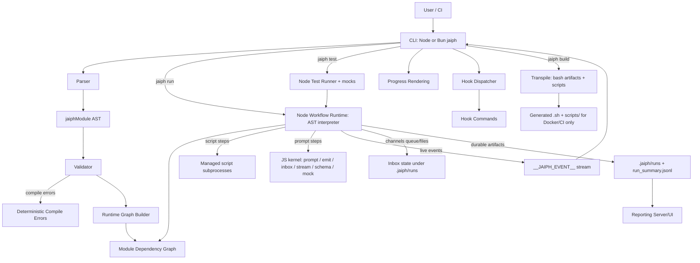
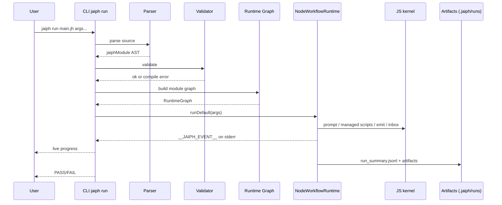
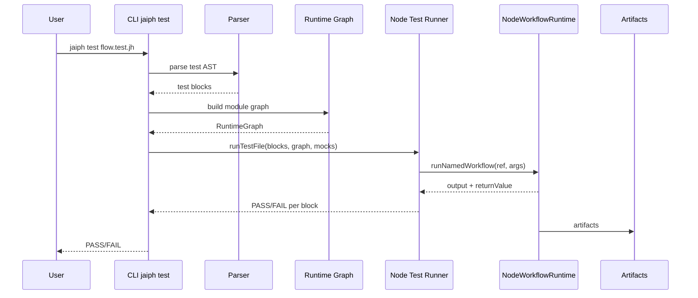

# Jaiph Architecture

This document describes how Jaiph is structured and how execution flows through the system for both:

- regular workflows (`*.jh`),
- Jaiph runtime tests (`*.test.jh`).

## System overview

Jaiph is a single-runtime workflow system with a **TypeScript CLI** and a **Node.js orchestration kernel** that interprets the AST directly:

1. Parse source into AST.
2. Validate references and language constraints.
3. **CLI** (Node from `dist/src/cli.js`, or a **Bun-compiled** `jaiph` binary) builds the runtime graph and launches the **Node workflow runtime** (`NodeWorkflowRuntime`) which interprets workflow steps from the AST. Script steps execute as managed subprocesses; prompt, inbox I/O, and event/summary emission are handled by the JS kernel under `src/runtime/kernel/`.
4. Stream live events to CLI and persist durable run artifacts.

There is **one runtime**: the Node workflow runtime. All orchestration (`jaiph run`, `jaiph test`) goes through the AST interpreter — there is no Bash orchestration path.

## Core components

- **CLI (`src/cli`)**
  - Entry point (`run`, `build`, `test`, `init`, `use`, `report`).
  - **Workflow launch** is owned in TypeScript (`src/runtime/kernel/workflow-launch.ts` + `src/cli/run/lifecycle.ts`): builds the runtime graph and spawns the Node workflow runner process.
  - Parses runtime events and renders progress; dispatches hooks.

- **Parser (`src/parser.ts`, `src/parse/*`)**
  - Converts `.jh`/`.test.jh` into `jaiphModule` AST.

- **AST / Types (`src/types.ts`)**
  - Shared compile-time schema (`jaiphModule`, step defs, test defs, hook payload types).

- **Validator (`src/transpile/validate.ts`)**
  - Resolves imports and symbol references; emits deterministic compile-time errors.

- **Transpiler (`src/transpiler.ts`, `src/transpile/*`)**
  - `transpileFile()` emits Bash build artifacts + per-step source map entries. Used **only** by `jaiph build` for Docker/CI distribution output — not on the runtime execution path for `jaiph run` or `jaiph test`.

- **Node Workflow Runtime (`src/runtime/kernel/node-workflow-runtime.ts`)**
  - `NodeWorkflowRuntime` interprets the AST directly: walks workflow steps, manages scope/variables, delegates prompt and script execution to kernel helpers, handles channels/inbox/dispatch, emits events, and writes run artifacts.
  - `buildRuntimeGraph()` (`graph.ts`) builds a module dependency graph by following imports and resolving cross-module references.

- **Node Test Runner (`src/runtime/kernel/node-test-runner.ts`)**
  - Executes `*.test.jh` test blocks using `NodeWorkflowRuntime` with mock support (mock prompts, mock workflow/rule/script bodies). Pure Node — no Bash test transpilation.

- **JS kernel (`src/runtime/kernel/`)**
  - Prompt execution (`prompt.ts`), managed subprocess execution, streaming parse, schema, mocks, **`emit.ts`** (live `__JAIPH_EVENT__` + `run_summary.jsonl`), **`inbox.ts`** (file-backed inbox), **`workflow-launch.ts`** (spawn contract).

- **Runtime shell stdlib (`src/jaiph_stdlib.sh`)**
  - Sourced by Bash build artifacts produced by `jaiph build` (Docker/CI distribution). Not used by the Node runtime for `jaiph run` or `jaiph test`.

- **Reporting (`src/reporting/*`)**
  - Reads `.jaiph/runs` and `run_summary.jsonl`; `jaiph report` serves the local UI. Standalone binaries resolve static assets from `reporting/public` next to the executable when bundled.

## Runtime vs CLI responsibilities

### Runtime responsibilities (Node workflow runtime)

- Interpret the AST and execute workflow semantics directly (`NodeWorkflowRuntime`).
- Manage channels (`send`, routes, queue drain) through kernel logic.
- Emit step/log events; persist run logs and summary timeline.
- Prompt steps and managed script subprocesses: Node kernel owns execution, events, and control flow.
- Execute test blocks with mock support (`NodeTestRunner`).

### CLI responsibilities

- Parse, validate, and launch workflows/tests.
- Own **process spawn** for `jaiph run` (detached workflow runner process group for signal propagation).
- Parse live runtime events; render terminal progress; trigger hooks.

## Contracts

- **Live contract (runtime -> CLI):** `__JAIPH_EVENT__` JSON lines on stderr (and related step metadata).
- **Durable contract:** `.jaiph/runs/...` + `run_summary.jsonl`.

Channel transport remains file/queue based in runtime inbox logic.

## Channels and hooks in context

(Unchanged semantics; see previous docs.) Channels are AST → validated → executed via queue/dispatch in the Node runtime. Hooks load from `hooks.json` and run as shell commands with JSON on stdin.

## Jaiph runtime testing (`*.test.jh`)

`*.test.jh` files use the same parser/AST pipeline. `jaiph test` builds the runtime graph, constructs a `NodeWorkflowRuntime` with mock bodies resolved via the graph, and executes test blocks directly in Node. Mock prompts, workflows, rules, and functions are supported through the runtime's mock infrastructure.

## CLI progress reporting pipeline

Static tree from AST (`progress.ts`); runtime events (`events.ts`, `stderr-handler.ts`); emitter (`emitter.ts`); display (`display.ts`, `progress.ts`).

## Distribution: Node vs Bun standalone

- **Development / npm:** `npm run build` → `tsc` + copy `runtime/kernel/` and `reporting/public` into `dist/`. `node dist/src/cli.js` runs the CLI.
- **Standalone:** `npm run build:standalone` produces `dist/jaiph` (Bun `--compile`) and copies **`runtime/kernel/`** and **`reporting/public`** into **`dist/`** next to the binary. Reporting asset resolution falls back to `dirname(process.execPath)` so the bundle runs **without a Node.js install**. Target machines still need **bash** (or another interpreter) for `script` step subprocess execution and **Node.js** for the runtime kernel.

## Mermaid architecture diagram

## Sequence diagram: regular flow (`*.jh`)

## Sequence diagram: test flow (`*.test.jh`)

## TypeScript test organization

(Module tests in `src/**`, cross-cutting in `test/**`, e2e in `e2e/tests/*.sh` — unchanged.)

## Summary

- `.jh` / `*.test.jh` share parser/AST/validation; the **Node runtime interprets the AST directly** for all orchestration.
- **Single runtime:** `jaiph run` and `jaiph test` both execute through `NodeWorkflowRuntime` — there is no Bash orchestration path.
- **CLI** owns launch, observation, and hooks; **workflow execution** runs in the **Node workflow runtime**, with **script steps** as managed subprocesses.
- `jaiph build` produces Bash build artifacts for Docker/CI distribution but is **not** on the runtime execution path.
- Contracts: `__JAIPH_EVENT__`, `.jaiph/runs`, `run_summary.jsonl`, hook payloads.
