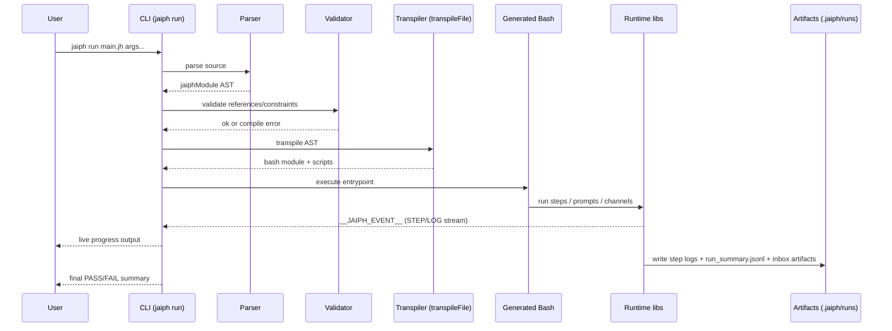
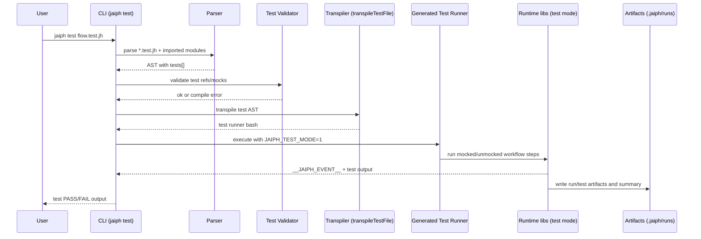

# Jaiph Architecture

This document describes how Jaiph is structured and how execution flows through the system for both:

- regular workflows (`*.jh`),
- Jaiph runtime tests (`*.test.jh`).

## System overview

Jaiph is a compiler-driven workflow runtime with a CLI observer layer:

1. Parse source into AST.
2. Validate references and language constraints.
3. Transpile to Bash modules/scripts.
4. Execute generated Bash on top of Jaiph runtime libraries.
5. Stream live events to CLI and persist durable run artifacts.

## Core components

- **CLI (`src/cli`)**
  - Entry point (`run`, `build`, `test`, `init`, `use`, `report`).
  - Orchestrates compile+execute lifecycle.
  - Parses runtime events and renders progress.
  - Dispatches hooks.

- **Parser (`src/parser.ts`, `src/parse/*`)**
  - Converts `.jh/.jph/.test.jh` into `jaiphModule` AST.
  - Parses workflows, rules, scripts, channels, routes, test blocks, metadata.

- **AST / Types (`src/types.ts`)**
  - Shared compile-time schema (`jaiphModule`, step defs, test defs, hook payload types).

- **Validator (`src/transpile/validate.ts`)**
  - Resolves imports and symbol references.
  - Enforces semantic constraints.
  - Emits deterministic compile-time errors.

- **Transpiler (`src/transpiler.ts`, `src/transpile/*`)**
  - `transpileFile()` for regular workflow modules.
  - `transpileTestFile()` for Jaiph test specs (`*.test.jh`).
  - Emits Bash code that calls runtime primitives.

- **Runtime libraries (`src/jaiph_stdlib.sh`, `src/runtime/*.sh`)**
  - Step execution, prompt flow, channels inbox/dispatch, event emission.
  - Writes artifacts to `.jaiph/runs`.

- **Reporting (`src/reporting/*`)**
  - Reads `.jaiph/runs` and `run_summary.jsonl`.
  - Serves local read-only run UI (`jaiph report`).

## Runtime vs CLI responsibilities

### Runtime responsibilities

- Execute workflow semantics.
- Manage channels (`send`, routes, queue drain).
- Emit step/log events.
- Persist run logs and summary timeline.

### CLI responsibilities

- Compile and launch workflows/tests.
- Parse live runtime events.
- Render terminal progress and summaries.
- Trigger hooks from lifecycle events.

## Contracts

Jaiph uses two runtime outputs:

- **Live contract (runtime -> CLI):** `__JAIPH_EVENT__` JSON lines on stderr
  - step start/end,
  - logs (`LOG`/`LOGERR`),
  - step metadata (depth, ids, params, dispatched markers).

- **Durable contract (runtime -> artifacts):** `.jaiph/runs/...`
  - step `.out/.err`,
  - prompt artifacts,
  - inbox files (`inbox/.seq`, `.queue`, `NNN-channel.txt`),
  - `run_summary.jsonl` (`STEP_*`, `LOG*`, `INBOX_*`, workflow boundaries).

Channel transport is file/queue based in runtime inbox logic; it is not carried by `__JAIPH_EVENT__`.

## Channels and hooks in context

### Channels

- Parsed as AST nodes (`channel`, `channel <- ...`, `channel -> workflow`).
- Validated at compile time (existence and target validity).
- Transpiled into inbox runtime calls (`inbox_init`, `register_route`, `send`, `drain_queue`).
- Executed in runtime via queue+dispatch in `src/runtime/inbox.sh`.

### Hooks

- Config:
  - global: `~/.jaiph/hooks.json`
  - project: `<workspace>/.jaiph/hooks.json`
- Loaded/merged by CLI.
- Triggered from run lifecycle events (`workflow_*`, `step_*`).
- Executed as shell commands with JSON payload on stdin.

## Jaiph runtime testing (`*.test.jh`)

`*.test.jh` files are Jaiph-level runtime tests, not production workflows.

- They use the same parser/AST pipeline but populate `tests` blocks.
- They are validated with test-specific reference rules (`validateTestReferences`).
- They transpile to a dedicated Bash test runner via `transpileTestFile()`.
- `jaiph test` executes that generated test runner in test mode:
  - sets test-mode env (`JAIPH_TEST_MODE`, etc.),
  - supports prompt mocks and workflow assertions,
  - still runs through runtime libraries.

This creates a dedicated test lane parallel to normal `.jh` execution.

## CLI progress reporting pipeline

- Static tree preparation from AST/imports (`src/cli/run/progress.ts`).
- Runtime event parsing (`src/cli/run/events.ts`, `src/cli/run/stderr-handler.ts`).
- Event bus fanout (`src/cli/run/emitter.ts`).
- Rendering (`src/cli/run/display.ts`, `progress.ts`):
  - TTY running footer with in-place updates,
  - non-TTY heartbeat lines for long-running steps.

## Mermaid architecture diagram

```mermaid
flowchart TD
    U[User / CI] --> CLI[CLI Entry: jaiph run/build/test/report]

    CLI --> P[Parser]
    P --> AST[jaiphModule AST]
    AST --> V[Validator]
    V -->|compile errors| ERR[Deterministic Compile Errors]

    V --> T1[Transpile Regular: transpileFile]
    V --> T2[Transpile Tests: transpileTestFile]

    T1 --> B1[Generated Bash Workflow Modules/Scripts]
    T2 --> B2[Generated Bash Test Runner]

    CLI -->|jaiph run| EX1[Execution Launcher]
    EX1 --> B1
    CLI -->|jaiph test| EX2[Execution Launcher (Test Mode)]
    EX2 --> B2

    B1 --> RT[Runtime Stdlib: steps/events/prompt/inbox]
    B2 --> RT

    RT -->|live events| EV["__JAIPH_EVENT__ stream"]
    EV --> CLI
    CLI --> PR[Progress Rendering]

    RT -->|channels queue/files| INBOX[Inbox Runtime State]
    RT -->|durable artifacts| SUM[.jaiph/runs + run_summary.jsonl]
    SUM --> REP[Reporting Server/UI]

    CLI --> HK[Hook Dispatcher]
    HK --> HPROC[Hook Commands]
```

## Sequence diagram: regular flow (`*.jh`)



## Sequence diagram: test flow (`*.test.jh`)



## Summary

- `.jh` and `*.test.jh` share parser/AST/validation foundations, then diverge at transpilation target.
- Runtime is the source of execution truth (steps, channels, artifacts).
- CLI is the orchestration and observation layer (launch, progress, hooks, summaries).
