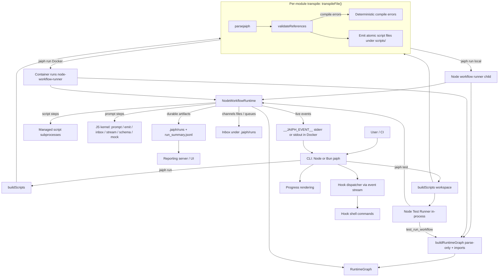
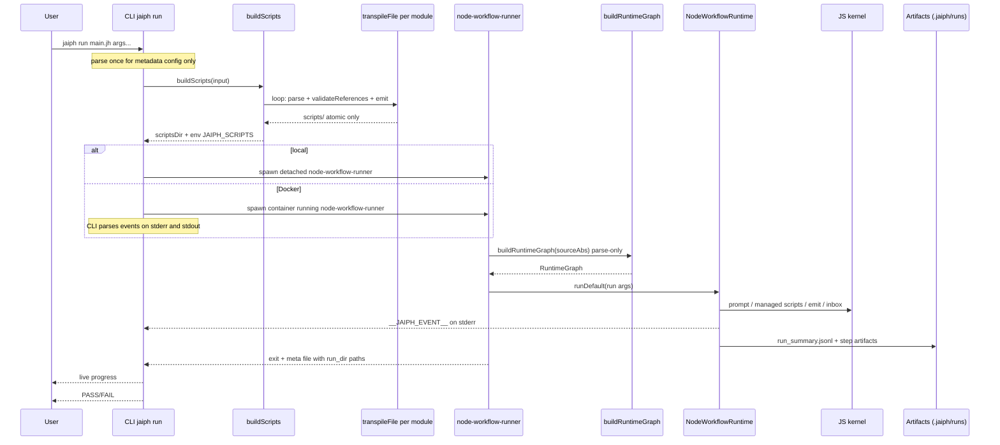
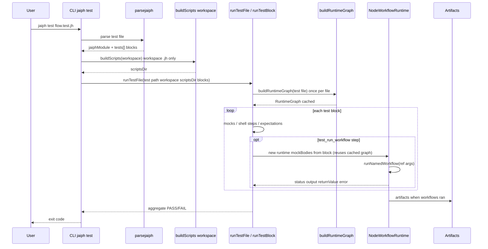

# Jaiph Architecture

This document describes how Jaiph is structured and how execution flows through the system for both:

- regular workflows (`*.jh`),
- Jaiph runtime tests (`*.test.jh`).

## System overview

Jaiph is a workflow system with a **TypeScript CLI**. The default orchestration path uses a **Node.js kernel** that interprets the AST directly:

1. Parse source into AST (quick parse on the CLI for `jaiph run` metadata; full graph loads use the same parser).
2. **Compile-time** validation (`validateReferences` inside `transpileFile`) runs during **`buildScripts()`**, not inside `buildRuntimeGraph()` (the graph loader only parses modules and follows imports).
3. **CLI** (Node from `dist/src/cli.js`, or a **Bun-compiled** `jaiph` binary) prepares script executables (scripts-only), spawns the **`node-workflow-runner`** child, **which** builds `RuntimeGraph` and runs **`NodeWorkflowRuntime`**. Script steps execute as managed subprocesses; prompt, inbox I/O, and event/summary emission are handled by the JS kernel under `src/runtime/kernel/`.
4. Stream live events to CLI and persist durable run artifacts.

All orchestration — local `jaiph run`, `jaiph test`, and **Docker `jaiph run`** — uses the **Node workflow runtime** (AST interpreter). Docker containers run the same `node-workflow-runner` process with the compiled JS source tree and scripts mounted read-only.

## Core components

- **CLI (`src/cli`)**
  - Entry point (`run`, `test`, `init`, `use`, `report`).
  - **Workflow launch** is owned in TypeScript (`src/runtime/kernel/workflow-launch.ts` + `src/cli/run/lifecycle.ts`): spawns the **Node workflow runner** (`node-workflow-runner.ts`), which calls `buildRuntimeGraph()` then `NodeWorkflowRuntime`.
  - Parses runtime events and renders progress; dispatches hooks.

- **Parser (`src/parser.ts`, `src/parse/*`)**
  - Converts `.jh`/`.test.jh` into `jaiphModule` AST.

- **AST / Types (`src/types.ts`)**
  - Shared compile-time schema (`jaiphModule`, step defs, test defs, hook payload types).

- **Validator (`src/transpile/validate.ts`)**
  - Resolves imports and symbol references; emits deterministic compile-time errors.

- **Transpiler (`src/transpiler.ts`, `src/transpile/*`)**
  - `transpileFile()` drives validation; **`buildScripts()`** — the path for all `jaiph run` / `jaiph test` execution — **persists only atomic `script` files** under `scripts/`.
  - `emitWorkflow` computes a module bash string containing function definitions (used by `build()` for golden/snapshot tests only). The emitted module has no stdlib preamble or entrypoint — it is not a runnable standalone bash program. No workflow `.sh` is written for production execution.

- **Node Workflow Runtime (`src/runtime/kernel/node-workflow-runtime.ts`)**
  - `NodeWorkflowRuntime` interprets the AST directly: walks workflow steps, manages scope/variables, delegates prompt and script execution to kernel helpers, handles channels/inbox/dispatch, emits events, and writes run artifacts.
  - `buildRuntimeGraph()` (`graph.ts`) loads reachable modules with **`parsejaiph` only** (import closure); it does **not** run `validateReferences`. Cross-module refs are resolved from that graph at runtime.

- **Node Test Runner (`src/runtime/kernel/node-test-runner.ts`)**
  - Executes `*.test.jh` test blocks using `NodeWorkflowRuntime` with mock support (mock prompts, mock workflow/rule/script bodies). Pure Node harness — no Bash test transpilation.

- **JS kernel (`src/runtime/kernel/`)**
  - Prompt execution (`prompt.ts`), managed subprocess execution, streaming parse, schema, mocks, **`emit.ts`** (live `__JAIPH_EVENT__` + `run_summary.jsonl`), **`inbox.ts`** (file-backed inbox), **`workflow-launch.ts`** (spawn contract).

- **Reporting (`src/reporting/*`)**
  - Reads `.jaiph/runs` and `run_summary.jsonl`; `jaiph report` serves the local UI. Standalone binaries resolve static assets from `reporting/public` next to the executable when bundled.

## Runtime vs CLI responsibilities

### Runtime responsibilities (Node workflow runtime)

- Interpret the AST and execute workflow semantics directly (`NodeWorkflowRuntime`).
- Manage channels (`send`, routes, queue drain) through kernel logic.
- Emit step/log events; persist run logs and summary timeline.
- Prompt steps and managed script subprocesses: Node kernel owns execution, events, and control flow.
- Execute test blocks with mock support (`NodeTestRunner`).

### CLI responsibilities

- Parse, validate, and launch workflows/tests.
- Own **process spawn** for `jaiph run` (detached workflow runner process group for signal propagation).
- Parse live runtime events; render terminal progress; trigger hooks.

## Contracts

- **Live contract (runtime -> CLI):** `__JAIPH_EVENT__` JSON lines on **stderr** by default; **`jaiph run` in Docker** also scans container **stdout** for the same event shapes (see `src/cli/commands/run.ts`).
- **Durable contract:** `.jaiph/runs/...` + `run_summary.jsonl`.

Channel transport remains file/queue based in runtime inbox logic.

## Channels and hooks in context

(Unchanged semantics; see previous docs.) Channels are AST → validated → executed via queue/dispatch in the Node runtime. Hooks load from `hooks.json` and run as shell commands with JSON on stdin.

## Jaiph runtime testing (`*.test.jh`)

`*.test.jh` files are parsed in the CLI; `runTestFile()` drives blocks in-process. **`buildRuntimeGraph(testFile)`** is called **once per `runTestFile` invocation** and the resulting graph is reused across all blocks and `test_run_workflow` steps (the import closure is constant for a given test file within a single process run). Each `test_run_workflow` step resolves mocks against that cached graph, then constructs `NodeWorkflowRuntime` with `mockBodies` / mock prompt env. Mock prompts, workflows, rules, and functions are supported through the runtime's mock infrastructure.
Before that, the CLI prepares script executables via **`buildScripts(workspace)`** so imported workflow modules have concrete script paths under `JAIPH_SCRIPTS` (workspace `*.jh` files only; `*.test.jh` is not part of that walk).

## CLI progress reporting pipeline

Static tree from AST (`progress.ts`); runtime events (`events.ts`, `stderr-handler.ts`); emitter (`emitter.ts`); display (`display.ts`, `progress.ts`).

## Distribution: Node vs Bun standalone

- **Development / npm:** `npm run build` → `tsc` + copy `runtime/kernel/` and `reporting/public` into `dist/`. `node dist/src/cli.js` runs the CLI.
- **Standalone:** `npm run build:standalone` produces `dist/jaiph` (Bun `--compile`) and copies **`runtime/kernel/`** and **`reporting/public`** into **`dist/`** next to the binary. Reporting asset resolution falls back to `dirname(process.execPath)` so the bundle runs **without a Node.js install**. Target machines still need **bash** (or another interpreter) for `script` step subprocess execution and **Node.js** for the runtime kernel.

## Mermaid architecture diagram

**Emit artifacts:** `buildScripts()` persists **only** extracted **`script`** bodies under `scripts/`. No workflow-level `.sh` files are produced for any production execution path. `build()` remains available for compiler golden/snapshot tests only. No `jaiph_stdlib.sh` exists; the emitted module string is not a runnable bash program.

## Sequence diagram: regular flow (`*.jh`)

## Sequence diagram: test flow (`*.test.jh`)

## TypeScript test organization

(Module tests in `src/**`, cross-cutting in `test/**`, e2e in `e2e/tests/*.sh` — unchanged.)

## Summary

- `.jh` / `*.test.jh` share parser/AST; **compile-time** validation runs in `transpileFile` during **`buildScripts`**. **`buildRuntimeGraph`** loads modules with **parse-only** imports.
- **Node-only runtime:** all execution — local `jaiph run`, Docker `jaiph run`, and `jaiph test` — goes through `NodeWorkflowRuntime`. Docker containers run `node-workflow-runner` with the compiled JS tree and scripts mounted, using the same semantics as local execution.
- **CLI** owns launch, observation, hooks, and runtime preparation (`buildScripts`). Workflow execution runs in **`NodeWorkflowRuntime`**, with **script steps** as managed subprocesses.
- No workflow-level `.sh` files or `jaiph_stdlib.sh` are produced or required. `build()` remains internal for compiler golden tests only.
- Contracts: `__JAIPH_EVENT__`, `.jaiph/runs`, `run_summary.jsonl`, hook payloads.
