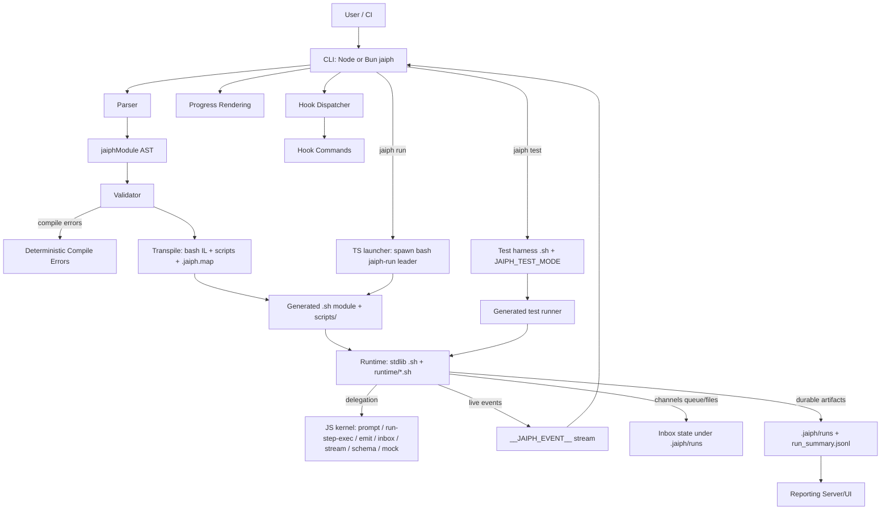
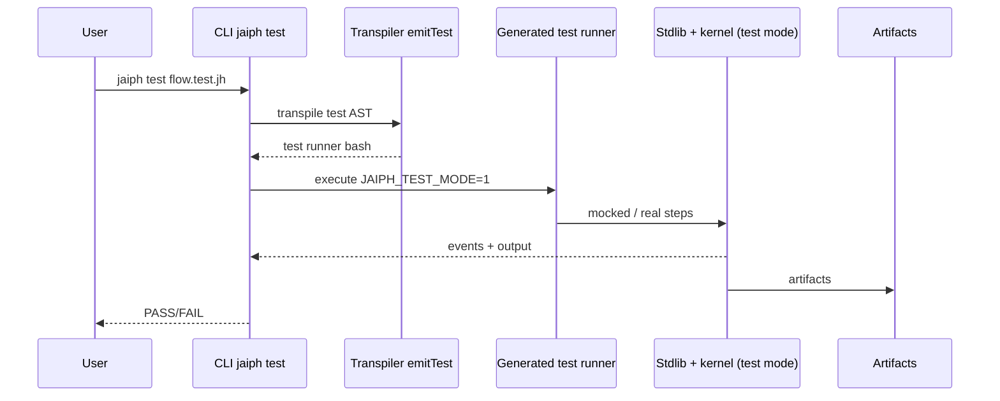

# Jaiph Architecture

This document describes how Jaiph is structured and how execution flows through the system for both:

- regular workflows (`*.jh`),
- Jaiph runtime tests (`*.test.jh`).

## System overview

Jaiph is a compiler-driven workflow runtime with a **TypeScript CLI** observer layer and a **generated shell intermediate** that executes workflow semantics on top of **TypeScript kernel** helpers:

1. Parse source into AST.
2. Validate references and language constraints.
3. Transpile to **bash modules/scripts** (intermediate representation) plus optional **`*.jaiph.map`** line metadata for diagnostics.
4. **CLI** (Node from `dist/src/cli.js`, or a **Bun-compiled** `jaiph` binary) builds outputs, resolves bundled `jaiph_stdlib.sh` / `runtime/`, and launches a **bash process group leader** (`jaiph-run`) that sources the generated module and enters `workflow default`. Prompt, inbox I/O, managed-step subprocesses, and event/summary emission delegate to the JS kernel under `src/runtime/kernel/`.
5. Stream live events to CLI and persist durable run artifacts.

**Authoring target** is `.jh` only. Bash is **emitted** for execution, not hand-written by users.

## Core components

- **CLI (`src/cli`)**
  - Entry point (`run`, `build`, `test`, `init`, `use`, `report`).
  - **Workflow launch** is owned in TypeScript (`src/runtime/kernel/workflow-launch.ts` + `src/cli/run/lifecycle.ts`): builds the bash wrapper, spawns the detached `jaiph-run` leader with correct stdio for `__JAIPH_EVENT__` parsing.
  - Parses runtime events and renders progress; dispatches hooks.
  - Optional **stderr rewriting**: when a `.jaiph.map` sidecar exists next to a generated `.sh`, bash error fragments (`file.sh: line N:`) are annotated with **`.jh` line/column** references.

- **Parser (`src/parser.ts`, `src/parse/*`)**
  - Converts `.jh`/`.test.jh` into `jaiphModule` AST.

- **AST / Types (`src/types.ts`)**
  - Shared compile-time schema (`jaiphModule`, step defs, test defs, hook payload types).

- **Validator (`src/transpile/validate.ts`)**
  - Resolves imports and symbol references; emits deterministic compile-time errors.

- **Transpiler (`src/transpiler.ts`, `src/transpile/*`)**
  - `transpileFile()` for regular workflow modules (bash IL + per-step source map entries).
  - `transpileTestFile()` for Jaiph test specs (`*.test.jh`).

- **Runtime shell libraries (`src/jaiph_stdlib.sh`, `src/runtime/*.sh`)**
  - Sourced by generated modules: step tracking, channels inbox/dispatch callouts, coordination with the kernel.
  - **Not** a separate “user-facing orchestration language”; they are the runtime implementation surface for the emitted IL.

- **JS kernel (`src/runtime/kernel/`)**
  - Prompt execution (`prompt.ts` / `prompt.js`), managed subprocess execution (`run-step-exec.ts`), streaming parse, schema, mocks, **`emit.ts`** (live `__JAIPH_EVENT__` + `run_summary.jsonl`), **`inbox.ts`** (file-backed inbox), **`workflow-launch.ts`** (bash wrapper string + spawn contract shared with Docker).

- **Reporting (`src/reporting/*`)**
  - Reads `.jaiph/runs` and `run_summary.jsonl`; `jaiph report` serves the local UI. Standalone binaries resolve static assets from `reporting/public` next to the executable when bundled.

## Runtime vs CLI responsibilities

### Runtime responsibilities

- Execute workflow semantics (via generated bash + stdlib, with kernel delegation).
- Manage channels (`send`, routes, queue drain) through kernel + shell glue.
- Emit step/log events; persist run logs and summary timeline.
- Prompt steps and managed subprocesses: Node kernel; shell retains step identity, events, and control flow around those calls.

### CLI responsibilities

- Compile and launch workflows/tests.
- Own **process spawn** for `jaiph run` (bash `jaiph-run` leader, detached process group for signal propagation).
- Parse live runtime events; render terminal progress; trigger hooks.

## Contracts

- **Live contract (runtime -> CLI):** `__JAIPH_EVENT__` JSON lines on stderr (and related step metadata).
- **Durable contract:** `.jaiph/runs/...` + `run_summary.jsonl`.
- **Diagnostics:** sibling **`basename(module).jaiph.map`** next to each generated **`*.sh`** (JSON: bash line → `.jh` source line/col) for CLI stderr enhancement.

Channel transport remains file/queue based in runtime inbox logic.

## Channels and hooks in context

(Unchanged semantics; see previous docs.) Channels are AST → validated → transpiled inbox calls → executed via queue/dispatch. Hooks load from `hooks.json` and run as shell commands with JSON on stdin.

## Jaiph runtime testing (`*.test.jh`)

`*.test.jh` files use the same parser/AST pipeline, `transpileTestFile()`, and `jaiph test` executes the generated bash harness in test mode (`JAIPH_TEST_MODE`, mocks, assertions) through the same stdlib + kernel stack as `jaiph run`.

## CLI progress reporting pipeline

Static tree from AST (`progress.ts`); runtime events (`events.ts`, `stderr-handler.ts`); emitter (`emitter.ts`); display (`display.ts`, `progress.ts`).

## Distribution: Node vs Bun standalone

- **Development / npm:** `npm run build` → `tsc` + copy `jaiph_stdlib.sh`, `runtime/`, `reporting/public` into `dist/`. `node dist/src/cli.js` resolves stdlib via `dist/src/cli/run/env` paths.
- **Standalone:** `npm run build:standalone` produces `dist/jaiph` (Bun `--compile`) and copies **`jaiph_stdlib.sh`**, **`runtime/`**, **`reporting/public`** into **`dist/`** next to the binary. `resolveBundledStdlibPath()` and reporting asset resolution fall back to `dirname(process.execPath)` so the bundle runs **without a Node.js install**. Target machines still need **bash** for the generated workflow module process.

## Mermaid architecture diagram



## Sequence diagram: regular flow (`*.jh`)

```mermaid
sequenceDiagram
    participant User
    participant CLI as CLI jaiph run
    participant Parser as Parser
    participant Validator as Validator
    participant Transpiler as Transpiler
    participant Bash as Bash jaiph-run + generated .sh
    participant Runtime as Stdlib + runtime/*.sh
    participant Kernel as JS kernel
    participant Report as Artifacts (.jaiph/runs)

    User->>CLI: jaiph run main.jh args...
    CLI->>Parser: parse source
    Parser-->>CLI: jaiphModule AST
    CLI->>Validator: validate
    Validator-->>CLI: ok or compile error
    CLI->>Transpiler: transpile AST
    Transpiler-->>CLI: bash module + scripts + map
    CLI->>Bash: spawn detached leader; source module; default workflow
    Bash->>Runtime: run steps / channels
    Runtime->>Kernel: prompt / managed steps / emit / inbox
    Runtime-->>CLI: __JAIPH_EVENT__ on stderr
    CLI-->>User: live progress
    Runtime->>Report: run_summary.jsonl + artifacts
    CLI-->>User: PASS/FAIL
```

## Sequence diagram: test flow (`*.test.jh`)



## TypeScript test organization

(Module tests in `src/**`, cross-cutting in `test/**`, e2e in `e2e/tests/*.sh` — unchanged.)

## Summary

- `.jh` / `*.test.jh` share parser/AST/validation; transpilation emits **bash IL** and optional **`.jaiph.map`** for diagnostics.
- **CLI orchestration is TypeScript-first** (launch, observation, hooks); **workflow execution** runs in a **bash** process group sourcing generated modules, with **kernel** work in **TypeScript**.
- Contracts: `__JAIPH_EVENT__`, `.jaiph/runs`, `run_summary.jsonl`, hook payloads.
