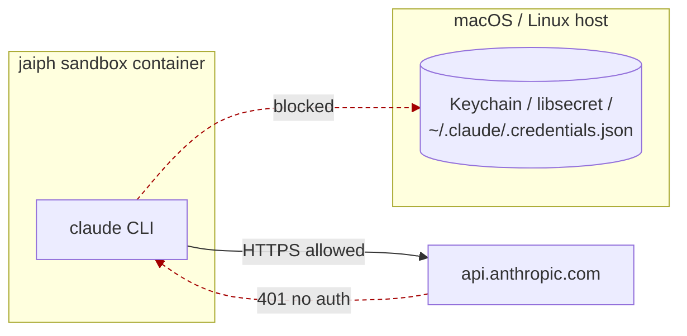
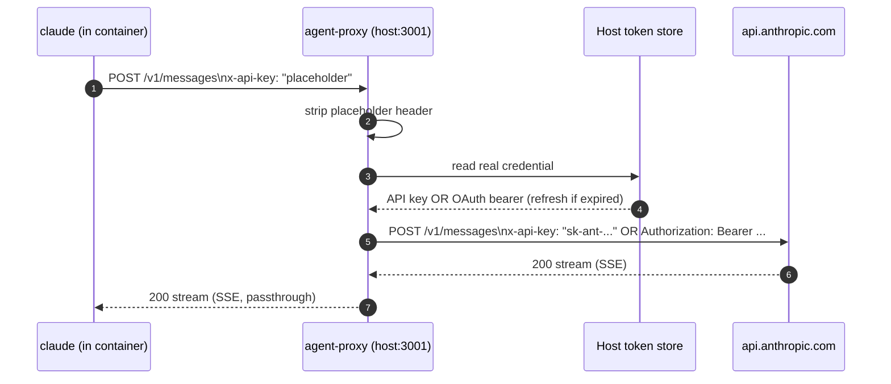
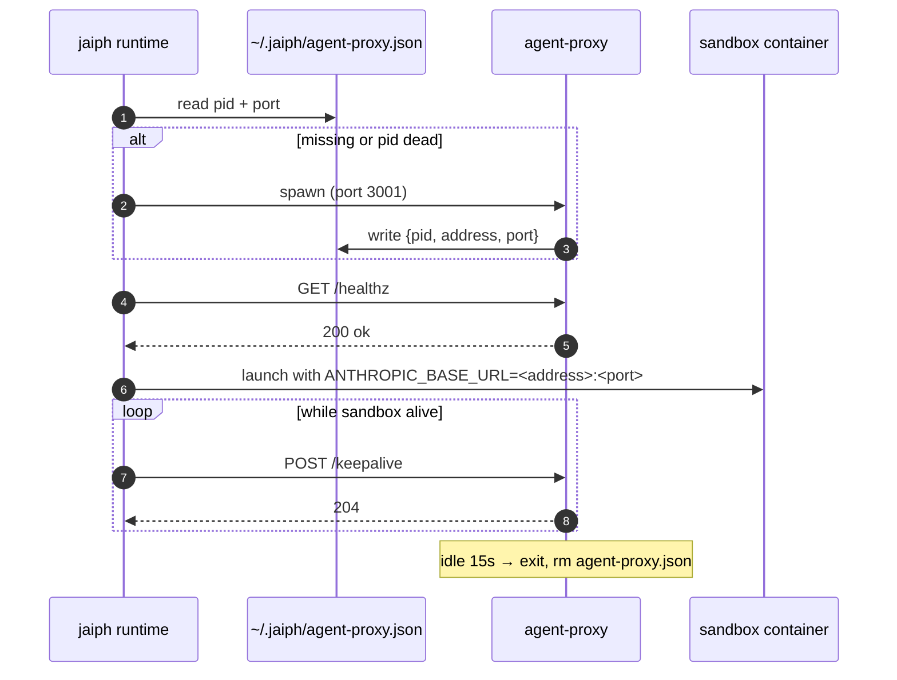

# agent-proxy — design doc

*Phantom Token credential proxy for the jaiph Docker sandbox. Container holds only a placeholder; real credentials live on the host and never cross the sandbox boundary.*

**Status:** design — ready for implementation
**Date (UTC):** 2026-05-12

## Problem

jaiph's sandbox (`src/runtime/docker.ts`) deliberately drops every host credential channel: `SSH_*`, `GITHUB_TOKEN`, `GIT_*`, and anything outside the `JAIPH_/ANTHROPIC_/CURSOR_/CLAUDE_` env allowlist. Host `~/.ssh`, `~/.gitconfig`, and `~/.claude` are not mounted. Network egress is allowed by default.

Container CLIs like `claude` therefore see no credentials and prompt `Not logged in`. Naively forwarding an API key as an env var would re-introduce exactly the exfiltration surface the sandbox was designed to remove — a prompt-injection attack on the agent could dump `process.env` at any time.



## Design — Phantom Token proxy

The container is given a *placeholder* credential (`ANTHROPIC_API_KEY=placeholder`) and a base URL pointing at a host proxy (`ANTHROPIC_BASE_URL=http://<host>:3001`). The proxy strips the placeholder on every request and injects the real credential — API key or OAuth bearer — pulled from the host token store, before forwarding to `api.anthropic.com`.

This is the **Phantom Token Pattern** (same shape as [NanoClaw](https://jonno.nz/posts/nanoclaw-architecture-masterclass-in-doing-less/)'s credential proxy). The container literally never holds the real secret — even a prompt-injection-driven env dump exfiltrates only the string `placeholder`. Secrets live in a plain in-memory object on the proxy, never in `process.env`.

### Request flow — strip and inject



### Lifecycle & discovery

Stopped by default. The runtime starts the daemon on first sandbox launch, every concurrent sandbox reuses the same instance, and the daemon self-exits 15s after the last keepalive. Discovery is a single file `~/.jaiph/agent-proxy.json` carrying `{pid, address, port}`; the runtime reads it, verifies the PID is alive, and respawns if not.



### Healthcheck

`GET /healthz` verifies token store reachable, credential valid (or refreshable), `api.anthropic.com` reachable. The runtime calls it before launching the container so auth failures surface up front, not deep inside a model request.

### Cross-platform token source (OAuth mode)

| Platform | Source | Reader |
|---|---|---|
| macOS | Keychain item `Claude Code-credentials` | `security find-generic-password -w` |
| Linux (GNOME/KDE) | libsecret via Secret Service | `secret-tool lookup ...` |
| Linux (headless) | `~/.claude/.credentials.json` | read file (with refresh) |

> API-key mode skips this entirely — the runtime passes `JAIPH_PROXY_API_KEY` to the daemon at spawn, which loads it into the in-memory `SECRET` object and scrubs `process.env`.

### Cross-platform bind address

`ensure.ts` resolves both sides; the daemon is platform-agnostic.

| Platform | Proxy binds to | Container reaches via |
|---|---|---|
| macOS / WSL2 | `127.0.0.1:3001` | `host.docker.internal:3001` (built-in) |
| Linux | `<docker0 bridge IP>:3001` | that same IP — resolved at sandbox launch |

## Codebase layout

All new code in one directory under `src/agent-proxy/`; matches the jaiph code philosophy (short files, ≤3 files per feature).

```
src/agent-proxy/
├── index.ts        # daemon entry: HTTP server, /healthz, /keepalive, idle-exit
├── secrets.ts      # cross-platform credential loader (API key + OAuth)
└── ensure.ts       # runtime-side: read state, spawn if dead, probe, return endpoint

e2e/tests/agent_proxy_*.bats   # phantom-token, lifecycle, healthcheck, concurrency...
src/runtime/docker.ts          # one new call site (see Wiring)
~/.jaiph/agent-proxy.json      # discovery state file shared runtime ↔ proxy
```

### File responsibilities

| File | Runs in | Responsibility | Public API |
|---|---|---|---|
| `index.ts` | spawned daemon | HTTP server, header strip + inject, write state file, idle-exit timer | CLI entry (no exports) |
| `secrets.ts` | spawned daemon | Read credential from Keychain / libsecret / file / env; refresh OAuth on expiry | `loadSecret()`, `refreshIfExpired()` |
| `ensure.ts` | jaiph runtime (host process) | Compute bind address, read state file, spawn daemon if not alive, probe `/healthz`, return endpoint | `ensureProxy(): Promise<{address, port}>`, `heartbeat()` |

## Reference implementation

Sketch of `src/agent-proxy/index.ts`. Daemon is platform-agnostic; the runtime tells it where to bind via env. Secrets loaded into `SECRET` (never `process.env`); placeholder stripped on every request.

```ts
// src/agent-proxy/index.ts — daemon entry; started on demand by the runtime
import http from "node:http";
import https from "node:https";
import fs from "node:fs";
import path from "node:path";
import os from "node:os";
import { loadSecret } from "./secrets.js";

const STATE   = path.join(os.homedir(), ".jaiph", "agent-proxy.json");
const BIND    = process.env.JAIPH_PROXY_BIND || "127.0.0.1";
const PORT    = Number(process.env.JAIPH_PROXY_PORT) || 3001;
const IDLE_MS = 15_000;

const SECRET = loadSecret();   // { mode: "apiKey" | "oauth", apiKey?, oauthToken? }

function inject(headers) {
  const h = { ...headers, host: "api.anthropic.com" };
  delete h["x-api-key"];                                // strip placeholder
  delete h["authorization"];
  if (SECRET.mode === "apiKey") h["x-api-key"]     = SECRET.apiKey;
  else                          h["authorization"] = `Bearer ${SECRET.oauthToken}`;
  return h;
}

let lastBeat = Date.now();

const server = http.createServer((req, res) => {
  if (req.url === "/healthz")   { return res.end("ok"); }
  if (req.url === "/keepalive") { lastBeat = Date.now(); res.statusCode = 204; return res.end(); }

  const up = https.request({
    host: "api.anthropic.com", path: req.url, method: req.method,
    headers: inject(req.headers),
  }, upRes => { res.writeHead(upRes.statusCode, upRes.headers); upRes.pipe(res); });
  req.pipe(up);
});

server.listen(PORT, BIND, () => {
  const { address, port } = server.address();
  fs.mkdirSync(path.dirname(STATE), { recursive: true });
  fs.writeFileSync(STATE, JSON.stringify({ pid: process.pid, address, port }));
});

setInterval(() => {
  if (Date.now() - lastBeat > IDLE_MS) {
    fs.rmSync(STATE, { force: true });
    process.exit(0);
  }
}, 1000);
```

> Elided: OAuth refresh, error mapping, request-body re-streaming for retries, libsecret reader.

## End-to-end tests

`e2e/tests/agent_proxy_*.bats`, run as part of `npm run test:e2e`:

- **Phantom token:** assert container env contains only `ANTHROPIC_API_KEY=placeholder`; capture outbound traffic from container, assert real key/token never appears.
- **Lifecycle:** launching a sandbox spawns the proxy and creates `agent-proxy.json`; stopping heartbeats causes exit + file removal within ~16s.
- **Concurrency:** two sandboxes launched in parallel share one proxy — port and PID unchanged across both.
- **Healthcheck:** `/healthz` returns 200 with a valid credential and 503 once the token is revoked / API key cleared.
- **Auth-mode switch:** proxy started in API-key mode and OAuth mode each pass an end-to-end model call from the container.
- **Token refresh:** force-expire the OAuth access token — the next request transparently refreshes via the host without the container noticing.
- **Streaming:** SSE response from `/v1/messages` arrives chunked in the container; no buffering at the proxy.
- **Platform matrix:** macOS (Keychain + 127.0.0.1), Linux GNOME (libsecret + docker0), Linux headless (file + docker0) all green in CI.

## Wiring into the runtime

`src/runtime/docker.ts` gains one call before container launch and one heartbeat loop alongside the existing sandbox lifecycle. No env allowlist change — `ANTHROPIC_API_KEY` and `ANTHROPIC_BASE_URL` already match the `ANTHROPIC_*` prefix.

```ts
// src/runtime/docker.ts (sketch of the new call sites)
import { ensureProxy, heartbeat } from "../agent-proxy/ensure.js";

const { address, port } = await ensureProxy();         // spawns daemon if needed

dockerArgs.push(
  "--env", "ANTHROPIC_API_KEY=placeholder",
  "--env", `ANTHROPIC_BASE_URL=http://${address}:${port}`,
);

const beat = setInterval(() => heartbeat(), 5_000);    // keepalive while container runs
container.on("exit", () => clearInterval(beat));
```
