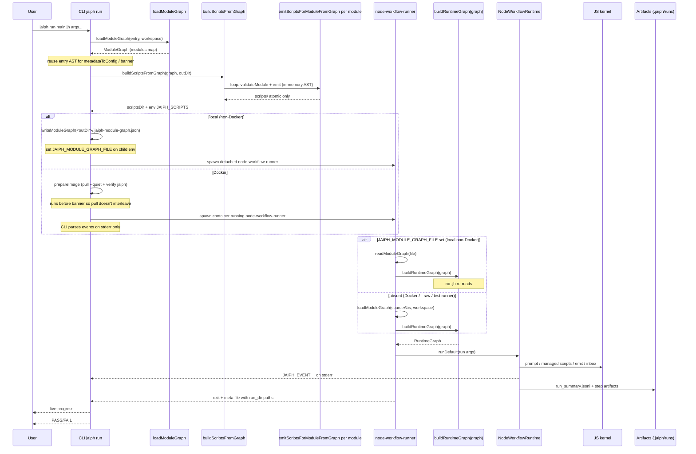
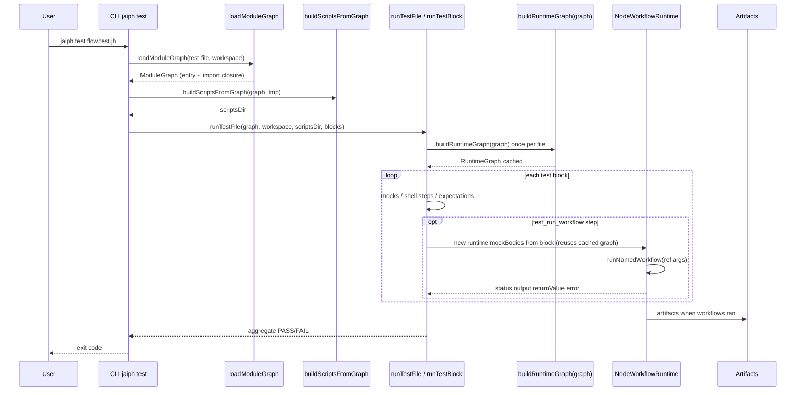

# Architecture

Jaiph is a workflow system with a **TypeScript CLI** and a **JavaScript kernel** (`src/runtime/kernel/`) that interprets the workflow AST in process — there is no separate “workflow shell” emitted for execution.

This page describes **how Jaiph is built**: repository layout of major subsystems, **core components**, compile and run pipelines, and **runtime contracts** (events, artifacts on disk, distribution). It is the map of the implementation. For workflow syntax and semantics, see the [Language](language.md) guide; this document stays on implementation boundaries.

**Why this split:** the transpiler turns each `script` block (and inline script bodies) into real files under `scripts/` with a stable layout and `JAIPH_SCRIPTS`, while **`NodeWorkflowRuntime` always executes from the AST** (`buildRuntimeGraph`). That separation keeps bash entrypoints predictable for subprocesses without duplicating workflow logic in a second language.

For **how to contribute** — branches, test layers, E2E assertion policy, and bash harness details — see [Contributing](contributing.md). For the `*.test.jh` **language** and test blocks, see [Testing](testing.md).

## System overview

Workflow authors write `.jh` / `.test.jh` modules. The toolchain turns those files into **validated** modules plus **extracted script files**, then the **same AST interpreter** runs workflows whether you use local `jaiph run`, Docker, or `jaiph test`.

1. Parse source into AST. Every CLI path walks the entry plus its transitive `.jh` import closure **once** through **`loadModuleGraph`** (`src/transpile/module-graph.ts`) and reuses that **`ModuleGraph`** for the banner (`metadataToConfig`), validation (**`validateReferences(graph)`**), script-body extraction (**`buildScriptsFromGraph`**), and — across the parent → child process boundary on the default local `jaiph run` — for **`buildRuntimeGraph(graph)`** in the spawned runner (see [Local module graph](#local-module-graph) and the sequence diagram below). `parsejaiph(source, filePath)` is I/O-pure; `validate` and `emit` operate entirely on the in-memory graph and never re-read `.jh` files. The only fs entry point that reads `.jh` sources is `loadModuleGraph`.
2. **Compile-time** validation runs before script extraction. The validator consumes the in-memory graph; imported ASTs are looked up by absolute path and never re-read from disk. Two entry points share the same per-module walk: `validateReferences(graph)` is the legacy throwing form (used by `emitScriptsForModuleFromGraph` / `buildScriptsFromGraph()` so the existing single-error path stays intact), and `collectDiagnostics(graph)` returns a populated `Diagnostics` collector (`src/diagnostics.ts`) with **every** recoverable error from every reachable module. The **`jaiph compile`** command walks the same import closure but routes through `collectDiagnostics`: it builds a graph per entry, collects diagnostics, prints them all (sorted by file/line/col, in `path:line:col CODE message` form on stderr — or as a single JSON array on stdout with `--json`), and exits non-zero if any diagnostic was collected. It **does not** emit **`scripts/`**, **does not** invoke **`buildRuntimeGraph()`**, and never spawns the workflow runner (`src/cli/commands/compile.ts`). For a **directory** argument it discovers `*.jh` via `walkjhFiles`, which **skips** `*.test.jh`; to validate a test module, pass that file explicitly. Imported modules in the closure are still validated recursively either way.
3. **CLI** (`dist/src/cli.js` via npm, or a **Bun-compiled** `dist/jaiph` binary) prepares script executables (scripts-only), then spawns a **detached child** that loads **`node-workflow-runner.js`**. That child calls `buildRuntimeGraph()` and runs **`NodeWorkflowRuntime`**. The child’s interpreter is **`process.execPath`** of the CLI process (Node when you run `node dist/src/cli.js`, the standalone Bun binary when you run `dist/jaiph`). Script steps execute as managed subprocesses; prompt, inbox I/O, and event/summary emission are handled by the kernel under `src/runtime/kernel/`.
4. Stream live events to the CLI and persist durable run artifacts.

Interactive **`jaiph run`** parses **`__JAIPH_EVENT__`** lines from the runner’s stderr, renders the progress tree, and runs hooks. **`jaiph run --raw`** skips that shell: the child uses inherited stdio so events still land on stderr unchanged — used when embedding Jaiph or when the host wraps a container (see [CLI — `jaiph run`](cli.md#jaiph-run) and [Sandboxing](sandboxing.md)).

All orchestration — local `jaiph run`, `jaiph test`, and **Docker `jaiph run`** — uses the **Node workflow runtime** (AST interpreter). Docker containers run the same `node-workflow-runner` process with the compiled JS source tree and scripts mounted read-only.

## Core components

- **CLI (`src/cli`, invoked via compiled `src/cli.ts` → `dist/src/cli.js`)**
  - Entry point (`run`, `test`, `compile`, `init`, `install`, `use`, `format`). Paths ending in `.jh` / `.test.jh` are also accepted as implicit commands (see `src/cli/index.ts`).
  - **Workflow launch** is owned in TypeScript (`src/runtime/kernel/workflow-launch.ts` + `src/cli/run/lifecycle.ts`): spawns **`node-workflow-runner.js`** with `process.execPath`, which calls `buildRuntimeGraph()` then `NodeWorkflowRuntime`. The **`jaiph run`** path always launches the **`default`** workflow via argv wired in `workflow-launch.ts` (`node-workflow-runner` calls `runDefault`). `setupRunSignalHandlers` accepts an optional `onSignalCleanup` callback for Docker sandbox teardown on SIGINT/SIGTERM.
  - Parses runtime events and renders progress (except `--raw`); dispatches hooks.

- **Parser (`src/parser.ts`, `src/parse/*`)**
  - Converts `.jh`/`.test.jh` into a **semantic AST** (`jaiphModule`) plus a parallel **`Trivia`** store of source-fidelity data. `parsejaiphWithTrivia(source, filePath)` returns `{ ast, trivia }`; the legacy `parsejaiph(source, filePath)` is a thin wrapper that returns only the `ast` for consumers that don't need round-trip data. Both entry points are I/O-pure.
  - Reusable primitives: `parseFencedBlock()` (`src/parse/fence.ts`) handles triple-backtick fenced bodies with optional lang tokens for scripts and inline scripts. `parseTripleQuoteBlock()` (`src/parse/triple-quote.ts`) handles `"""..."""` blocks for prompts, `const`, `log`, `logerr`, `fail`, `return`, and `send` — all positions where multiline strings appear. `canonicalizeTripleQuotedString()` (same file) reproduces the dedent + escape decoding that match-arm bodies still need (they carry an unprocessed `tripleQuoteBodyToRaw`-shaped string plus a `tripleQuotedBody` flag rather than being dedented at parse time); both the validator and the runtime call it, so "what the validator inspects" and "what the runtime executes" are bit-for-bit identical.
  - **Unified `run` / `ensure` host parsing.** `run ref(...)`, `run async ref(...)`, and `ensure ref(...)`, optionally followed by `catch (binding) { ... }` (any host) or `recover(binding) { ... }` (`run` only), are parsed by a single helper `parseRunOrEnsure` in `src/parse/workflow-brace.ts`. The attached `catch` / `recover` clause — bindings, body shape (multi-line `{ … }`, inline `{ stmt[; stmt]* }`, or single-statement) — is parsed by **one** helper `parseAttachedBlock(filePath, lines, idx, …, keyword, textAfterKeyword, trivia)` in `src/parse/steps.ts`. There is no separate mini parser for catch/recover bodies: `parseAttachedBlock` delegates each body statement to the **same** `parseBlockStatement` (`src/parse/workflow-brace.ts`) that handles top-level statements, so every statement form accepted in a workflow / rule body is accepted identically inside a `catch` / `recover` body. "Is this statement allowed inside a catch/recover body?" is a validator concern (the `RULE_SCOPE` / `WORKFLOW_SCOPE` distinction in `validate-step.ts`), not enforced by which mini-parser branches happened to fire. `src/parse/steps.ts` is bounded at **≤200 lines** by `src/parse/parse-attached-block.test.ts`, which also asserts no function named `parse(Run)?(Catch|Recover|EnsureStep)` reappears.
  - **Keyword dispatch table.** Inside `parseBlockStatement` (`src/parse/workflow-brace.ts`), every workflow / rule body line that does not begin with `#` is routed by a single `STATEMENT: Record<string, BlockHandler>` table keyed by the leading identifier — there is no longer a `startsWith` cascade where `"run async "` must be tested before `"run "` and `"prompt "` must be tested before a bare assignment. The dispatcher tokenizes the first identifier on the trimmed line, looks it up once, and invokes the matching handler (`tryParseIf` / `tryParseFor` / `tryParseConst` / `tryParseFail` / `tryParseWait` / `tryParseEnsure` / `tryParseRun` / `tryParsePrompt` / `tryParseLog` / `tryParseLogerr` / `tryParseReturn` / `tryParseStandaloneMatch`), which either returns a `{ step, nextIdx }` result, returns `null` to fall through, or calls `fail(...)` to abort. Two non-keyword fallbacks fire after the table lookup in order: `trySend` (matches `channel <- rhs` via `matchSendOperator`) then `shellFallthrough` (everything else becomes a shell `exec` step). Assignment-shape error guards (`name = prompt …`, `name = run …` without `const`, plus the `forRule` rejection of `prompt`) run once before dispatch in `applyAssignmentGuards(c)`. The per-line context (`filePath`, `lines`, `idx`, `innerRaw`, `inner`, `innerNo`, `trivia`, `forRule`, `opts`) is threaded through handlers as a single `BlockCtx` record. **Adding a new top-level keyword is a two-file change:** one row in `STATEMENT` (`workflow-brace.ts`) plus one entry in the `JAIPH_KEYWORDS` reserved set (`core.ts`) — pinned by `src/parse/parse-synthetic-keyword.test.ts`, which patches `STATEMENT` at runtime with a synthetic `zzznoop` handler, asserts dispatch fires, asserts the same input falls through to the shell handler when the row is removed, and greps both source files to confirm each symbol lives in exactly one place. Every existing parse-error message, line, and column is preserved bit-for-bit: `src/parse/parse-error-snapshot.test.ts` walks every `=== name` block in `test-fixtures/compiler-txtar/parse-errors.txt`, captures `{ file, line, col, code, message }` for each, and diffs against the snapshot stored at `test-fixtures/compiler-txtar/parse-errors-snapshot.json` (refreshable with `UPDATE_SNAPSHOTS=1` only after confirming the change is intentional). The wider tokenizer rewrite — the ad-hoc `inDoubleQuote` / `inTripleQuote` / `braceDepth` scanners replicated across `src/parse/`, the line-walking `{ step, nextIdx }` contract, and the per-handler regex bodies — is **not** part of this refactor and remains future work.

- **AST / Types (`src/types.ts`)**
  - Shared compile-time schema (`jaiphModule`, step defs, test defs, hook payload types). The semantic AST carries **only** what the validator, emitter, transpiler, and runtime need; surface-form data that exists purely to round-trip the formatter (leading comments on imports / channels / `const` / `test` blocks, top-level emit order, `config` body sequence, `"""..."""` flags on `literal` / `return` / `log` / `logerr` / `fail` / `send` / `const`, the `bareSource` of `return <ident>`, and prompt / script `bodyKind` discriminators) lives in **`Trivia`** instead — see [Trivia (CST layer)](#trivia-cst-layer).
  - **One `Expr` for every value position.** Anywhere a value can appear — `const name = …`, `return …`, `send channel <- …`, `log` / `logerr` / `fail` arguments, and the body of an `exec` statement — the AST stores a single tagged union: `Expr = literal | call | ensure_call | inline_script | prompt | match | shell | bare_ref`. There is **no longer** a separate `ConstRhs` union, `SendRhsDef` union, or `managed:` sidecar on `return` / `log` / `logerr` (the placeholder strings `"__match__"` / `"run inline_script"` / `"__JAIPH_MANAGED__"` are gone too — a meta-test in `src/types-shape.test.ts` fails if any reappear under `src/`). The eight `Expr` kinds: `literal` (verbatim source text — quoted string, `$var` / `${var}` form, or post-dedent triple-quoted body), `call` (managed workflow/script call; `async: true` for `run async ref(...)` capture position), `ensure_call` (managed rule call), `inline_script` (`` `body`(args) `` or fenced), `prompt` (carries the JSON-quoted body and optional flat `returns` schema), `match` (a `match <subject> { ... }` evaluated for its value), `shell` (raw shell fragment used as a managed substitution on the send RHS), and `bare_ref` (bare symbol on a send RHS — always rejected by the validator, preserved so the error message can name the symbol).
  - **Eight `WorkflowStepDef` variants** (down from fourteen): `exec` (side-effecting managed call statement — was `run` / `ensure` / `run_inline_script` / `prompt` / standalone `match` / inline `shell`; the discriminator now lives inside `body.kind`, with `captureName` / `catch` / `recover` as step-level attributes); `const`, `return`, `send` (bind, propagate, or emit an `Expr`); `say` (was `log` / `logerr` / `fail` — `level: "fail"` aborts the workflow with the message, otherwise the message is written to the corresponding stream); `if` / `for_lines` (control flow, unchanged shape); `trivia` (formatter-only `comment` / `blank_line` slots — skipped by the runtime and validator). A type-level exhaustive `switch` in `src/types-shape.test.ts` pins both the step count at **8** and the `Expr` kind count at **8**.
  - **Call arguments are a typed sum.** Every call-bearing `Expr` (`call`, `ensure_call`, `inline_script`) carries `args?: Arg[]` where `Arg = { kind: "literal"; raw: string } | { kind: "var"; name: string }`. The parser classifies each argument once (a bare in-scope-style identifier becomes `var`; everything else — quoted strings, `${…}` interpolations, nested `run …` / `ensure …` calls, inline-script bodies — is stored verbatim as `literal`). There is no separate `args: string` text payload or shadow `bareIdentifierArgs: string[]` field, and no downstream consumer re-parses call arguments: the validator walks the typed list to enforce arity, reject nested unmanaged calls inside literals, and resolve `var` refs against in-scope bindings; the emitter renders by mapping each `Arg` to its source form; the runtime turns `Arg[]` back into a runtime string via `argsToRuntimeString` (`var` → `${name}`, `literal` → raw) so the existing handle-resolution / interpolation path is unchanged.

- **Trivia / CST layer (`src/parse/trivia.ts`)**
  {: #trivia-cst-layer}
  - `Trivia` is a parallel store keyed by AST-node identity (per-node via `WeakMap`) and a small `ModuleTrivia` record for module-level data. The parser builds it alongside the AST; **only the formatter reads it**. Validator, emitter, transpiler, and runtime never import from `src/parse/trivia.ts` — a grep test (`src/parse/trivia-grep.test.ts`) pins this invariant by rejecting any reference to `Trivia` / `createTrivia` / `NodeTrivia` / `ModuleTrivia` from validator and emitter source files.
  - A separate type-shape test (`src/parse/trivia-ast-shape.test.ts`) asserts at compile time that none of the formatter-only fields reappear on `jaiphModule`, `ImportDef`, `ScriptImportDef`, `ChannelDef`, `TestBlockDef`, `WorkflowMetadata`, `ScriptDef`, or any `WorkflowStepDef` / `Expr` variant. (`ConstRhs` / `SendRhsDef` no longer exist — their fields live inside `Expr` — and `src/types-shape.test.ts` fails if those symbols reappear as exports of `src/types.ts`.)

- **Validator (`src/transpile/validate.ts` + `src/transpile/validate-step.ts`)**
  - Resolves imports and symbol references; emits deterministic compile-time errors. Import resolution (`resolveImportPath` in `transpile/resolve.ts`) checks relative paths first, then falls back to project-scoped libraries under `<workspace>/.jaiph/libs/` — the workspace root is threaded through all compilation call sites. Export visibility is enforced by `validateRef` in `validate-ref-resolution.ts`: if an imported module declares any `export`, only exported names are reachable through the import alias.
  - **Two-file split.** `validate.ts` owns the **outer** layer: import / channel-route / test-block checks plus `walkStepTree` (the single descent that builds `{ knownVars, promptSchemas, flat }` for each workflow / rule). `validate-step.ts` owns the **per-step** visitor: one row per `WorkflowStepDef.type` in a `VALIDATORS: Record<StepType, StepValidator>` table, a single `validateExpr` dispatcher over the 8 `Expr.kind` values, and the call-shape / channel / string-content helpers. `validate.ts` is bounded at **≤700 lines** (currently ~430) by a CI-style test in `src/transpile/validate-visitor.test.ts`; new validators belong in `validate-step.ts`.
  - **Visitor table + scope.** Per-step validation has one entry point — `validateStep(step, ctx)` in `validate-step.ts`. It looks the step's `type` up in `VALIDATORS` (the dispatch table), then consults `ctx.scope.allowSteps` (a `Set<StepType>`) once to decide whether this step is permitted in the current scope. Two scopes exist: `WORKFLOW_SCOPE` (allows every step variant including `send` and `prompt`) and `RULE_SCOPE` (rejects `send` outright; rejects `prompt` and `run async` from inside `exec` bodies). The scope also carries `runRefExpect` (`RUN_TARGET_REF_EXPECT` for workflows, `RUN_IN_RULE_REF_EXPECT` for rules) and `withPromptSchemas` (workflows collect prompt-returning bindings; rules skip schema collection). Adding a new step type requires exactly one row in `VALIDATORS` and, if the rule/workflow split needs to differ, an entry in `Scope.allowSteps` — an `AC4` test in `validate-visitor.test.ts` injects a synthetic step type and asserts it produces exactly one diagnostic with the documented `internal: no validator for step type "…"` message until the row is added.
  - **Single managed-call-shape helper.** Every `call` / `ensure_call` site runs the same five checks against the typed `Arg[]` directly — shell-redirection rejection (only `literal` args are scanned), nested-unmanaged-call rejection inside `literal` raws, ref resolution (with the scope's `runRefExpect` for `call`, `RULE_REF_EXPECT` for `ensure_call`), arity (`args.length` vs declared params), and `var`-arg resolution against in-scope bindings via `validateArgVarRefs`. The sequence lives once in `validateCallable(expr, ctx)`; both `run` and `ensure` validators invoke it with a different ref expectation / target kind. There is no longer a separate `validateBareIdentifierArgs` helper, no per-site repetition of the five-step sequence, and no place re-parses an `args: string` payload by splitting on commas or rescanning quotes.
  - **Diagnostics collector (recoverable errors).** The validator no longer fails fast on the first user-level error. Every recoverable check appends to a `Diagnostics` collector (`src/diagnostics.ts`) via `diag.error(file, line, col, code, msg)`, which records a `JaiphDiagnostic` and short-circuits the current validation unit through a `BailoutError`. Each top-level unit (per-import block, per-rule walk, per-rule step, per-workflow walk, per-workflow step, per-test-block step, per-channel route) is wrapped in `diag.capture(fn)`, which absorbs the bailout (and any thrown `jaiphError` from leaf helpers like `validate-ref-resolution.ts` / `validate-string.ts` / `validate-prompt-schema.ts` / `shell-jaiph-guard.ts`) so the next sibling unit still runs. `collectDiagnostics(graph)` walks every module and returns the populated collector; the legacy `validateReferences(graph)` is now a thin wrapper that throws the first sorted diagnostic via `jaiphError` so existing per-error tests and the `emitScriptsForModuleFromGraph` path keep working unchanged. `Diagnostics.sorted()` returns errors ordered by `(file, line, col)`; `formatLines()` renders the standard `path:line:col CODE message` shape. A grep test (`src/transpile/diagnostics-collector.test.ts`) pins the migration: `validate.ts` + `validate-step.ts` hold **zero** `throw jaiphError(` sites, and the remaining `throw jaiphError(` call sites under `src/` are confined to a documented allowlist — fatal aborts in the parser (`src/parse/core.ts`), the loader (`src/transpile/module-graph.ts`), and the test-file shape check (`src/cli/commands/test.ts`); the legacy bridge in `src/diagnostics.ts`; and the four leaf validation helpers above, each of which has every caller wrapped in `diag.capture(...)`.
  - The validator drives off `WorkflowStepDef.type` (8 variants) and `Expr.kind` (8 variants). For every value-bearing step (`const` / `return` / `send` / `say`) and for the body of every `exec` step, a single `validateExpr(expr, ...)` dispatcher handles the value: it routes `call` / `ensure_call` / `inline_script` to call-site validation (`validateCallable`), walks `match` arms, schema-checks `prompt`, and runs the substitution scanner on `literal` raws. There is no dual code path for "managed sidecar vs literal value" — that branch is gone.
  - **No compile-time → runtime imports.** Nothing under `src/transpile/` may `import … from "…/runtime/…"`. Compile-time code must not depend on runtime semantics: when the validator needs the same canonical form the runtime will see (the dedented, escape-decoded view of a triple-quoted match-arm body), both sides import a parser-side helper (`canonicalizeTripleQuotedString` in `src/parse/triple-quote.ts`) rather than reaching across the layer. A grep test (`src/transpile/no-runtime-imports.test.ts`) scans every non-test `*.ts` under `src/transpile/` and fails if any `from "…/runtime/…"` import appears; a separate corpus test (`src/parse/canonicalize-triple-quoted.test.ts`) parses every `.jh` under `test-fixtures/` and `examples/`, collects every triple-quoted match-arm body, and asserts `canonicalizeTripleQuotedString` matches the pre-move `tripleQuotedRawForRuntime` output bit-for-bit.
  - **Single workflow walk.** Each workflow / rule has its step tree descended exactly once by `walkStepTree` (in `validate.ts`), which simultaneously accumulates `knownVars` (env decls + params + every nested `const` / capture / `for_lines` iterator), `promptSchemas` (top-level prompt-returning bindings, gated by `options.withPromptSchemas` so rules skip schema collection), enforces immutable-binding / `script`-collision rules inline (mutating a shared `bindings` map and threading a fresh inner map under each `for_lines` so loop iterators only shadow inside the body), and emits a flat `FlatStepEntry[]` of every step in tree order with the enclosing `catch` / `recover` failure binding attached. The main per-step validator loop iterates that flat list non-recursively and calls `validateStep` once per entry, so `walkStepTree`'s internal `descend` is the **only** recursive helper in `validate.ts` that takes a `WorkflowStepDef[]`. A pair of grep / AST tests (`src/transpile/validate-single-walk.test.ts`) pins both invariants: the prior helpers (`collectKnownVars`, `collectPromptSchemas`, `validateImmutableBindings`) cannot reappear by name, and at most one recursive `WorkflowStepDef[]` walker may live in `validate.ts`.

- **Transpiler (`src/transpiler.ts`, `src/transpile/*`)**
  - **`emitScriptsForModuleFromGraph`** validates one module against the graph and runs **`buildScriptFiles`** — the only compile path for `jaiph run` / `jaiph test` — **persists only atomic `script` files** under `scripts/`. **`buildScripts(input, outDir, ws?)`** is the path-based wrapper used by tests and the directory walk; it loads a `ModuleGraph` and delegates. **`buildScriptsFromGraph(graph, outDir)`** is the graph-based entry point used by `jaiph run` / `jaiph test`, which already loaded the graph. Inline scripts (`` run `body`(args) ``) are also emitted as `scripts/__inline_<hash>` with deterministic hash-based names (`inlineScriptName` in `src/inline-script-name.ts`). There is no workflow-level bash emission.
  - The pipeline contract is `loadModuleGraph` → `validateReferences(graph)` → `emit(graph, outDir)`. `parsejaiph` is I/O-pure; `validate` and `emit` never touch `.jh` on disk. Each reachable module is parsed exactly once per `jaiph run` (see [Local module graph](#local-module-graph)).

- **Node Workflow Runtime (`src/runtime/kernel/node-workflow-runtime.ts`)**
  - `NodeWorkflowRuntime` interprets the AST directly: walks workflow steps, manages scope/variables, delegates prompt and script execution to kernel helpers, handles channels/inbox/dispatch, owns the frame stack and heartbeat, and writes run artifacts.
  - One private `evaluateExpr(scope, expr, …)` dispatcher handles every value position — `const` / `return` / `send` / `say` step handlers and the body of every `exec` step delegate to it. It switches on `Expr.kind` to run the managed call (`call` / `ensure_call` / `inline_script`) or `prompt`, walks a `match` expression, or interpolates a `literal` value through `interpolateWithCaptures`. There is no fan-out across "managed sidecar vs literal value" because that branch is gone from the AST.
  - **Prompt transport-failure retry.** `runPromptStep` wraps each `executePrompt` invocation in a retry loop driven by the schedule resolved through `src/runtime/kernel/prompt-retry.ts` (default `15s → 1m → 10m → 30m → 2h`, six total attempts; configurable via `JAIPH_PROMPT_RETRY` / `JAIPH_PROMPT_RETRY_DELAYS`). Only the transport path (non-zero exit from the backend) is retried; invalid JSON and schema-validation failures return `{ ok: false }` on the first attempt. Each attempt emits its own `PROMPT_START` / `PROMPT_END` and `STEP_START` / `STEP_END`; each failure (and the final termination) logs a `LOGERR` through `RuntimeEventEmitter.emitLog`. The backoff sleep is injectable (`sleep` constructor option) and interruptible via `runtime.abort()` / an internal `AbortController` so SIGINT and in-process aborts halt the loop without further backend calls. Retry composes **below** `recover` / `catch` — backoff is exhausted before the failure reaches the recover loop. See [Configuration — Prompt retry on transport failure](configuration.md#prompt-retry-on-transport-failure).
  - Three sibling modules under `src/runtime/kernel/` carry concerns that used to live inline in the runtime file. Dependency direction is one-way (orchestrator → helpers/emitter/mock); no circular imports back.
    - **`runtime-arg-parser.ts`** — stateless interpolation and call-argument parsing (`interpolate`, `parseInlineCaptureCall`, `commaArgsToInterpolated`, `parseArgsRaw`, `parseInlineScriptAt`, `parseManagedArgAt`, `parseArgTokens`, `stripOuterQuotes`, `parsePromptSchema`, `sanitizeName`, `nowIso`) plus shared constants and the `ParsedArgToken` / `PromptSchemaField` types. Direct unit tests live in `runtime-arg-parser.test.ts`.
    - **`runtime-event-emitter.ts`** — `RuntimeEventEmitter` owns **`__JAIPH_EVENT__`** writes on stderr (step/log traffic when not suppressed), **`run_summary.jsonl`** appends for the wider timeline (including workflow/prompt records that are summary-first), plus step/prompt sequence counters. Constructed with `{ runId, runDir, env, getFrameStack, getAsyncIndices, suppressLiveEvents? }`; the runtime delegates structured emission to it. The optional `suppressLiveEvents` flag (forwarded from `NodeWorkflowRuntime`'s `suppressLiveEvents` option) skips the live stderr **`__JAIPH_EVENT__`** lines while **`appendRunSummaryLine`** keeps updating **`run_summary.jsonl`** — used by in-process callers like the test runner that share stderr with `node --test` reporter output. The CLI's spawned `node-workflow-runner` child does not set it, so production runs stream events to stderr as before.
    - **`runtime-mock.ts`** — `executeMockBodyDef` and `executeMockShellBody` for `*.test.jh` workflow/rule/script mocks. Shell-kind mocks run `bash -c`; steps-kind mocks dispatch back into the runtime via an `executeStepsBack` callback so the body runs against the full step interpreter.
  - `buildRuntimeGraph()` (`graph.ts`) accepts either an entry file path (legacy) or an already-loaded `ModuleGraph` and returns the runtime-ready view by injecting `ScriptDef` stubs for **`script import`** declarations so reference resolution matches the validated compile path without re-reading external script bodies. Cross-module refs are resolved from that graph at runtime. `RuntimeGraph` is a type alias for `ModuleGraph` — there is one canonical "all reachable modules" representation. The stub-injection helper (`attachScriptImportStubs`) is idempotent.

- **Node Test Runner (`src/runtime/kernel/node-test-runner.ts`)**
  - Executes `*.test.jh` test blocks using `NodeWorkflowRuntime` with mock support (mock prompts, mock workflow/rule/script bodies). Pure Node harness — no Bash test transpilation.

- **JS kernel (`src/runtime/kernel/`)**
  - Prompt execution (`prompt.ts`), streaming parse (`stream-parser.ts`), schema (`schema.ts`), **`mock.ts`** (sequential prompt responses / mock-arm dispatch from test env JSON), **`runtime-mock.ts`** (mock workflow/rule/script **bodies** for `*.test.jh`), **`emit.ts`** (durable **`run_summary.jsonl`** helpers — `appendRunSummaryLine`, `formatUtcTimestamp` — consumed by `RuntimeEventEmitter`), **`workflow-launch.ts`** (spawn contract). **`RuntimeEventEmitter`** (`runtime-event-emitter.ts`) owns live **`__JAIPH_EVENT__`** lines on stderr and coordinates summary writes plus step/prompt sequence counters. Script subprocesses are launched directly from `NodeWorkflowRuntime`.

- **Formatter (`src/format/emit.ts`)**
  - `jaiph format` rewrites `.jh` / `.test.jh` files into canonical style. `emitModule(ast, trivia, opts?)` reads the semantic AST together with the parallel **`Trivia`** store ([Trivia (CST layer)](#trivia-cst-layer)) to round-trip leading comments, top-level order, `config` body sequence, `"""..."""` and `bareSource` forms, the original quotedness of top-level `const` values (`EnvDeclDef.wasQuoted` — `true` for `"…"` / `"""…"""` sources, `undefined` for bare tokens — so a quoted value is never silently rewritten as bare based on whether it contains a space), and prompt / script body discriminators. Step emission switches on `WorkflowStepDef.type` (8 variants) and an `emitExpr` helper switches on `Expr.kind` (8 kinds) — there are no dual code paths for "managed sidecar vs literal value" because that branch was removed from the AST. Call arguments render straight off the typed `Arg[]` — `var` → bare name, `literal` → raw — so the formatter no longer re-parses any args string or consults a `bareIdentifierArgs` shadow field. Pure data→text emitter; no side-effects beyond file writes. Round-trip is bit-for-bit on every fixture under `examples/` and `test-fixtures/golden-ast/fixtures/` — pinned by `src/format/roundtrip.test.ts`, which asserts `parse → format → parse → format` converges in one step on every fixture.

- **Docker runtime helper (`src/runtime/docker.ts`)**
  - Parses mount specs, resolves Docker config (image, network, timeout), and builds the `docker run` invocation when the CLI enables **Docker sandboxing** for `jaiph run` (environment-driven; there is no `jaiph run --docker` flag — see [Sandboxing](sandboxing.md)). The container runs the same `node-workflow-runner` entry as local execution. The default image is the official `ghcr.io/jaiphlang/jaiph-runtime` GHCR image; every selected image must already contain `jaiph` (no auto-install or derived-image build at runtime). Image preparation (`prepareImage`) runs before the CLI banner: it checks whether the image is local, pulls with `--quiet` if needed (short status lines on stderr instead of Docker’s default pull UI), and verifies that `jaiph` exists in the image. `spawnDockerProcess` does not pull or verify — it receives a pre-resolved image. The spawn call uses `stdio: ["ignore", "pipe", "pipe"]` — stdin is ignored so the Docker CLI does not block on stdin EOF, which would stall event streaming and hang the host CLI after the container exits.
  - **Workspace immutability:** By default Docker runs cannot modify the host workspace. The host checkout is mounted read-only (overlay) or as a disposable clone (copy); `/jaiph/workspace` is sandbox-local and discarded on exit. The only host-writable path is `/jaiph/run` (run artifacts). Workflows that need to capture workspace changes should write files (for example a `git diff` into a temp path) and publish them with `artifacts.save()`. The explicit opt-in **inplace** mode (`JAIPH_INPLACE=true`) breaks this contract on purpose — the host workspace itself is bind-mounted read-write so the run's edits persist live on the host, with the rest of the sandbox (caps, env allowlist, mount set) unchanged. See [Sandboxing](sandboxing.md) for the full contract and [Libraries — `jaiphlang/artifacts`](libraries.md#jaiphlangartifacts--publishing-files-out-of-the-sandbox).

## Local module graph
{: #local-module-graph}

The toolchain has one canonical representation — **`ModuleGraph`** — for "all `.jh` modules reachable from an entry point, parsed once." The same graph is used by the validator, the script emitter, and the runtime; on the default local `jaiph run` path it also crosses the parent CLI → child runner boundary so each reachable `.jh` is parsed exactly **once** per run.

- **`loadModuleGraph(entryFile, workspaceRoot?)`** (`src/transpile/module-graph.ts`) walks the entry plus its transitive `import` edges through `resolveImportPath` and returns `{ entryFile, workspaceRoot?, modules: Map<absPath, { filePath, ast, imports: Map<alias, absPath> }> }`. **`jaiphlang/<name>`** library imports resolve through the same workspace fallback as the rest of the toolchain. This is the **only** routine that reads `.jh` sources from disk; `parsejaiph(source, filePath)` itself is I/O-pure.
- **`src/cli/commands/run.ts`** calls `loadModuleGraph` once after path normalization. The entry AST is reused for **`metadataToConfig(mod.metadata)`** (banner / `runtime` config). The same graph is passed to **`buildScriptsFromGraph(graph, outDir)`**, which calls `emitScriptsForModuleFromGraph` per reachable module; `validateReferences(graph)` runs against the in-memory ASTs.
- **Process boundary.** The CLI serializes the graph with **`writeModuleGraph`** to **`<outDir>/.jaiph-module-graph.json`** (deterministic JSON: entries sorted by absolute path; ASTs included verbatim). It points the spawned **`node-workflow-runner.js`** at the file through the internal env var **`JAIPH_MODULE_GRAPH_FILE`**. The runner reads it back with **`readModuleGraph`** and passes the result to **`buildRuntimeGraph(graph)`**, which produces the runtime view (with `script import` stub injection) without touching disk. Cross-module workflow / rule / script resolution matches the on-disk load path.
- **Scope of the env-var hand-off.** `JAIPH_MODULE_GRAPH_FILE` is set **only** when the host CLI spawns the local **`node-workflow-runner.js`** child with Docker sandboxing disabled (`dockerConfigForBanner.enabled === false`). It is **not** set on these paths, which load the graph from disk inside the runner instead:
  - **`jaiph run --raw`** — `runWorkflowRaw` (`src/cli/commands/run.ts`) calls `buildScripts` directly without writing the graph file; the runner uses inherited stdio and falls back to `loadModuleGraph` from the source file.
  - **Docker `jaiph run`** — the host writes the graph file under `outDir`, but skips the env var because the inner container command is `jaiph run --raw …` and the host bind-mount layout does not plumb the cache file inside the container.
  - **`jaiph test`** — `runSingleTestFile` builds the graph in `src/cli/commands/test.ts` and threads it through `runTestFile(graph, ...)` directly (no env var needed; same process).

  When the env var is absent the runner falls back to the disk-walk parse path, preserving prior behavior.

User-visible contracts (banner, hooks, run artifacts, `run_summary.jsonl`, `return_value.txt`, exit codes, `__JAIPH_EVENT__` streaming) are unchanged.

## Runtime vs CLI responsibilities

### Runtime responsibilities (Node workflow runtime)

- Interpret the AST and execute workflow semantics directly (`NodeWorkflowRuntime`).
- Manage channels (`send`, routes, queue drain) through kernel logic.
- Emit step/log events; persist run logs and summary timeline.
- Prompt steps and managed script subprocesses: Node kernel owns execution, events, and control flow.
- Execute test blocks with mock support (`runTestFile()` in `node-test-runner.ts`).

### CLI responsibilities

- Parse, validate, and launch workflows/tests.
- Own **process spawn** for `jaiph run` (detached workflow runner process group for signal propagation).
- Parse live runtime events; render terminal progress; trigger hooks — skipped in **`jaiph run --raw`** (child stdio inherited; see [CLI](cli.md#jaiph-run)).

## Contracts

- **Live contract (runtime → observing process):** `__JAIPH_EVENT__` JSON lines on **stderr only** — the structured event channel. Hooks and the interactive CLI consume that stream; see [Hooks](hooks.md).
- **Durable contract:** `.jaiph/runs/...` + `run_summary.jsonl` (layout below).

Channel transport remains file/queue based in runtime inbox logic.

### Durable artifact layout

For an onboarding-style description of the same paths (what to expect in a repo, what to ignore in git), see [Runtime artifacts](artifacts.md).

The runtime persists step captures and the event timeline under a UTC-dated hierarchy:

```
.jaiph/runs/
  <YYYY-MM-DD>/                       # UTC date (see NodeWorkflowRuntime)
    <HH-MM-SS>-<source-basename>/       # UTC time + JAIPH_SOURCE_FILE or entry basename
      000001-module__step.out          # stdout capture per step (6-digit seq prefix)
      000001-module__step.err          # stderr capture (may be empty)
      artifacts/                       # user-published files (JAIPH_ARTIFACTS_DIR); created at run start
      inbox/                           # audit copies of routed channel payloads (optional)
      heartbeat                        # liveness: epoch ms, refreshed about every 10s
      return_value.txt                 # when `jaiph run` default workflow returns a value (success only)
      run_summary.jsonl                # durable event timeline
```

Step sequence numbers are monotonic and unique per run: `RuntimeEventEmitter` allocates them in memory (`allocStepSeq`) when opening each step’s capture files (`%06d-<safe_name>.out|.err`). There is no `.seq` file in the run directory.

## Channels and hooks in context

Channels are validated at compile time (`validateReferences` / send RHS rules) and executed via in-memory queue and dispatch in the Node runtime; durable **`inbox/`** files under the run directory appear only for **routed** sends (audit — see [Inbox & Dispatch](inbox.md)). Hooks are CLI-only: they load from `hooks.json` and run as shell commands with JSON on stdin, driven by the same `__JAIPH_EVENT__` stream as the progress UI — see [Hooks](hooks.md).

## Test runner integration (`*.test.jh` in the kernel)

**How** `jaiph test` wires into the same stack as `jaiph run`: `runSingleTestFile` (`src/cli/commands/test.ts`) calls `loadModuleGraph(testFileAbs, workspaceRoot)` once, then threads the resulting `ModuleGraph` through `buildScriptsFromGraph(graph, tmpDir)` and `runTestFile(graph, …)`. `runTestFile` calls `buildRuntimeGraph(graph)` once per file and the runtime view is reused across all blocks and `test_run_workflow` steps (the import closure is constant for a given test file within a single process run). Each `test_run_workflow` step resolves mocks against that runtime view, then constructs `NodeWorkflowRuntime` with `mockBodies` / mock prompt env, passing **`suppressLiveEvents: true`** so **`RuntimeEventEmitter`** skips writing **`__JAIPH_EVENT__`** lines to **stderr** while still appending **`run_summary.jsonl`** for that run. Without this flag, every workflow event would print to the test process's stderr and swamp `node --test` reporter output. Mock prompts, workflows, rules, and scripts are supported through the runtime's mock infrastructure.

The `buildScriptsFromGraph` call writes `scripts/` so imported workflows have paths under `JAIPH_SCRIPTS`. Unrelated `*.jh` files elsewhere in the repo are not compiled unless imported.

Authoring rules, fixtures, and mock syntax for `*.test.jh` are documented in [Testing](testing.md), not here.

## CLI progress reporting pipeline

The progress UI combines a **static** step tree derived from the workflow AST (`src/cli/run/progress.ts`) with **live** updates from the runtime event stream. Event wiring: `src/cli/run/events.ts` and `src/cli/run/stderr-handler.ts` parse `__JAIPH_EVENT__` lines; `src/cli/run/emitter.ts` bridges into the renderer. Line-oriented formatting (`formatStartLine`, `formatHeartbeatLine`, `formatCompletedLine`) lives primarily in `src/cli/run/display.ts`, which shares some display helpers with `progress.ts`. Async branch numbering (subscript ₁₂₃… prefixes) is driven by `async_indices` on step and log events — the runtime propagates a chain of 1-based branch indices through `AsyncLocalStorage`, and the stderr handler renders them at the appropriate indent level. `const` steps whose `Expr` value is `kind: "match"` are walked for nested `run` / `ensure` arms; matched targets appear as child items in the step tree (e.g. `▸ script safe_name` under the `const` row). This pipeline does not apply to **`jaiph run --raw`**.

## Distribution: Node vs Bun standalone

- **Development / npm:** `npm run build` runs `npm run embed-assets` (regenerates **`src/runtime/embedded-assets.ts`** from `runtime/overlay-run.sh` and `docs/jaiph-skill.md`, and **`src/version.ts`** from `package.json`'s `version` field), then `tsc`, copies **`src/runtime/`** to **`dist/src/runtime/`** (kernel, `docker.ts`, etc.), and copies **`runtime/overlay-run.sh`** from the repo root into **`dist/src/runtime/overlay-run.sh`**. The published `jaiph` bin is **`node dist/src/cli.js`**.
- **Standalone:** `npm run build:standalone` runs the same build, copies **`dist/src/runtime`** to **`dist/runtime`** beside the binary, then `bun build --compile ./src/cli.ts --outfile dist/jaiph`. Workflow launch self-spawns via **`process.execPath`** using the internal **`__workflow-runner`** argv marker (`src/runtime/kernel/workflow-launch.ts` + `src/cli/index.ts`): the node build invokes `node dist/src/cli.js __workflow-runner …`; the bun-compiled binary invokes itself, `jaiph __workflow-runner …`. The reserved marker is excluded from `--help`/usage and the file-shorthand path. `overlay-run.sh` and `docs/jaiph-skill.md` are also embedded base64 inside the executable via **`src/runtime/embedded-assets.ts`**, so the standalone artifact is **fully self-contained** — no sibling `runtime/` or `docs/` files required. The displayed `jaiph --version` string is sourced from the generated **`src/version.ts`** (codegen'd from `package.json` by `embed-assets`), so the literal is statically baked into both the `tsc` and the `bun build --compile` outputs without a runtime read of `package.json`. **Bash** (or whatever shebang your `script` steps use) is still required on the host for script subprocesses. Ship **`dist/jaiph`** alone, or with **`dist/runtime`** alongside it for parity with the npm layout (table in [Contributing](contributing.md)).
- **Release artifacts:** `.github/workflows/release.yml` cross-compiles the standalone binary for **darwin/linux × arm64/x64** on **`v*`** tag pushes and on pushes to the **`nightly`** branch, generates a `SHA256SUMS` covering the four binaries, runs a `--version` sanity gate on the linux-x64 output, and uploads the five assets to the matching GitHub Release (stable tag or rolling **`nightly`** prerelease). Asset filenames are fixed by the installer contract — see [Contributing — Release asset naming contract](contributing.md#release-asset-naming-contract).

## Mermaid architecture diagram

```mermaid
flowchart TD
    U[User / CI] --> CLI[CLI: Node or Bun jaiph]

    subgraph Transpile["Per-module: emitScriptsForModuleFromGraph()"]
        VAL[validateReferences]
        EMIT[Emit atomic script files under scripts/]
        VAL -->|compile errors| ERR[Deterministic compile errors]
        VAL --> EMIT
    end

    CLI -->|jaiph run| LMG1[loadModuleGraph entry + closure]
    LMG1 --> BS1[buildScriptsFromGraph]
    BS1 --> Transpile

    CLI -->|jaiph test| LMG2[loadModuleGraph(entry .test.jh)]
    LMG2 --> BS2[buildScriptsFromGraph]
    BS2 --> Transpile
    LMG2 --> TR[Node Test Runner in-process]

    Transpile -->|jaiph run local| RW[Node workflow runner child]
    Transpile -->|jaiph run Docker| DC[Container runs node-workflow-runner]
    LMG1 -. JAIPH_MODULE_GRAPH_FILE (local non-Docker only) .-> RW

    RW --> G[buildRuntimeGraph from graph]
    G --> GRAPH[RuntimeGraph]
    RW --> RT[NodeWorkflowRuntime]
    RT --> GRAPH

    DC --> G
    DC --> RT

    TR -->|test_run_workflow| G
    TR --> RT

    RT -->|script steps| SCRIPT[Managed script subprocesses]
    RT -->|prompt steps| KERNEL[Kernel libs: prompt, events, inbox, stream, schema, mock]

    RT -->|live events| EV["__JAIPH_EVENT__ stderr only"]
    EV --> CLI
    CLI --> PR[Progress rendering]

    RT -->|channels files / queues| INBOX[Inbox under .jaiph/runs]
    RT -->|durable artifacts| SUM[.jaiph/runs + run_summary.jsonl]
    CLI --> HK[Hook dispatcher via event stream]
    HK --> HPROC[Hook shell commands]
```

**Emit artifacts:** `buildScripts()` persists **only** extracted **`script`** bodies under `scripts/`. No workflow-level shell modules or `jaiph_stdlib.sh` are produced.

## Sequence diagram: regular flow (`*.jh`)

Interactive **`jaiph run`** (no **`--raw`**): banner, progress tree, hooks, and PASS/FAIL footer.



**Docker:** the inner container command is **`jaiph run --raw …`** (see [Sandboxing](sandboxing.md)): no banner or progress UI inside the container; **`__JAIPH_EVENT__`** lines still appear on stderr for the host CLI to parse.

## Sequence diagram: `jaiph test` flow



## Summary

- `.jh` / `*.test.jh` share parser/AST. The pipeline is **`loadModuleGraph` → `validateReferences(graph)` → `emit(graph, outDir)`**; `parsejaiph` is I/O-pure and `validate` / `emit` operate entirely in-memory. **`buildRuntimeGraph`** consumes the same `ModuleGraph` (loaded in the runner from disk or — on the default local **`jaiph run`** path — deserialized from the parent CLI's graph file via **`JAIPH_MODULE_GRAPH_FILE`**; see [Local module graph](#local-module-graph)).
- **`jaiph compile`** walks import closures through **`collectDiagnostics(graph)`** (the multi-error sibling of **`validateReferences`**), prints the full diagnostic set sorted by `(file, line, col)`, and exits non-zero on any non-empty set — no **`scripts/`** emission (**no **`buildScriptFiles`** / **`buildScripts`**), no **`buildRuntimeGraph()`**, no runner spawn. Directory discovery omits **`*.test.jh`** unless you pass a test file explicitly.
- **Node-only runtime:** all execution — local `jaiph run`, Docker `jaiph run`, and `jaiph test` — goes through `NodeWorkflowRuntime`. Docker containers run `node-workflow-runner` with the compiled JS tree and scripts mounted, using the same semantics as local execution.
- **CLI** owns launch, observation, hooks (except **`jaiph run --raw`**), and runtime preparation (`buildScripts`). **`jaiph run --raw`** still emits **`__JAIPH_EVENT__`** on stderr from the runtime; the CLI does not attach the interactive progress/hooks pipeline. **`jaiph test`** passes **`suppressLiveEvents: true`** into **`NodeWorkflowRuntime`** so **`RuntimeEventEmitter`** skips writing those live stderr lines while **`run_summary.jsonl`** still records workflow traffic where the emitter appends it.
- Workflow execution runs in **`NodeWorkflowRuntime`**, with **script steps** as managed subprocesses.
- No workflow-level `.sh` files or `jaiph_stdlib.sh` are produced or required.
- Contracts: `__JAIPH_EVENT__`, `.jaiph/runs`, `run_summary.jsonl`, hook payloads.
