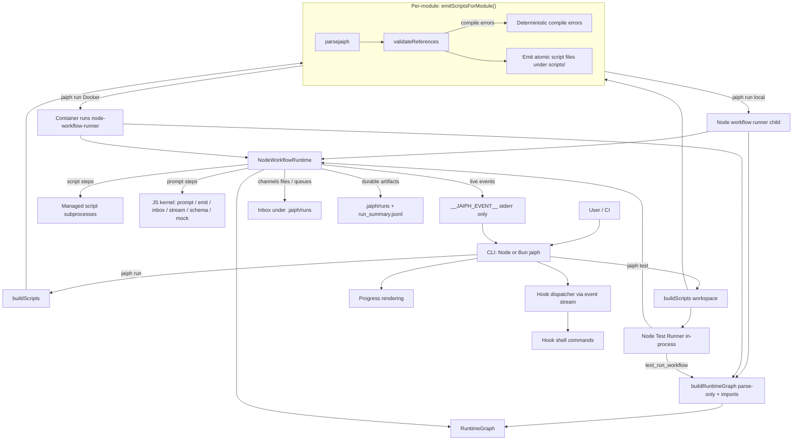
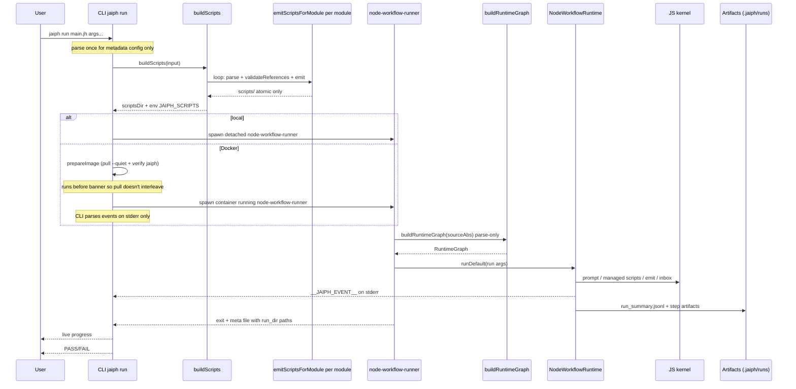
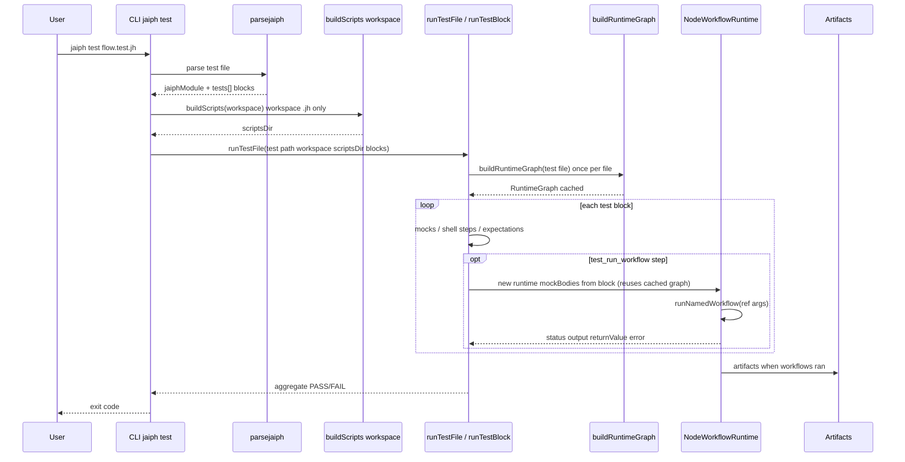

# Architecture

Jaiph is a workflow system with a **TypeScript CLI** and a **Node.js kernel** that interprets the AST directly.

This page describes **how Jaiph is built**: repository layout of major subsystems, **core components**, compile and run pipelines, and **runtime contracts** (events, artifacts on disk, distribution). It is the map of the implementation.

For **how to contribute** — branches, test layers, E2E assertion policy, and bash harness details — see [Contributing](contributing.md). For the `*.test.jh` **language** and test blocks, see [Testing](testing.md).

## System overview

1. Parse source into AST (quick parse on the CLI for `jaiph run` metadata; full graph loads use the same parser).
2. **Compile-time** validation (`validateReferences`, invoked from **`emitScriptsForModule`** / **`buildScripts()`**) runs before script extraction, not inside `buildRuntimeGraph()` (the graph loader only parses modules and follows imports).
3. **CLI** (Node from `dist/src/cli.js`, or a **Bun-compiled** `jaiph` binary) prepares script executables (scripts-only), spawns the **`node-workflow-runner`** child, **which** builds `RuntimeGraph` and runs **`NodeWorkflowRuntime`**. Script steps execute as managed subprocesses; prompt, inbox I/O, and event/summary emission are handled by the JS kernel under `src/runtime/kernel/`.
4. Stream live events to CLI and persist durable run artifacts.

All orchestration — local `jaiph run`, `jaiph test`, and **Docker `jaiph run`** — uses the **Node workflow runtime** (AST interpreter). Docker containers run the same `node-workflow-runner` process with the compiled JS source tree and scripts mounted read-only.

## Core components

- **CLI (`src/cli`)**
  - Entry point (`run`, `test`, `init`, `install`, `use`, `format`).
  - **Workflow launch** is owned in TypeScript (`src/runtime/kernel/workflow-launch.ts` + `src/cli/run/lifecycle.ts`): spawns the **Node workflow runner** (`node-workflow-runner.ts`), which calls `buildRuntimeGraph()` then `NodeWorkflowRuntime`. `setupRunSignalHandlers` accepts an optional `onSignalCleanup` callback for Docker sandbox teardown on SIGINT/SIGTERM.
  - Parses runtime events and renders progress; dispatches hooks.

- **Parser (`src/parser.ts`, `src/parse/*`)**
  - Converts `.jh`/`.test.jh` into `jaiphModule` AST.
  - Reusable primitives: `parseFencedBlock()` (`src/parse/fence.ts`) handles triple-backtick fenced bodies with optional lang tokens for scripts and inline scripts. `parseTripleQuoteBlock()` (`src/parse/triple-quote.ts`) handles `"""..."""` blocks for prompts, `const`, `log`, `logerr`, `fail`, `return`, and `send` — all positions where multiline strings appear.

- **AST / Types (`src/types.ts`)**
  - Shared compile-time schema (`jaiphModule`, step defs, test defs, hook payload types).

- **Validator (`src/transpile/validate.ts`)**
  - Resolves imports and symbol references; emits deterministic compile-time errors. Import resolution (`resolveImportPath` in `resolve.ts`) checks relative paths first, then falls back to project-scoped libraries under `<workspace>/.jaiph/libs/` — the workspace root is threaded through all compilation call sites. Export visibility is enforced by `validateRef` in `validate-ref-resolution.ts`: if an imported module declares any `export`, only exported names are reachable through the import alias.

- **Transpiler (`src/transpiler.ts`, `src/transpile/*`)**
  - **`emitScriptsForModule`** parses, runs **`validateReferences`**, and **`buildScriptFiles`** — the only compile path for `jaiph run` / `jaiph test` — **persists only atomic `script` files** under `scripts/`. Inline scripts (`` run `body`(args) ``) are also emitted as `scripts/__inline_<hash>` with deterministic hash-based names. There is no workflow-level bash emission.

- **Node Workflow Runtime (`src/runtime/kernel/node-workflow-runtime.ts`)**
  - `NodeWorkflowRuntime` interprets the AST directly: walks workflow steps, manages scope/variables, delegates prompt and script execution to kernel helpers, handles channels/inbox/dispatch, emits events, and writes run artifacts.
  - `buildRuntimeGraph()` (`graph.ts`) loads reachable modules with **`parsejaiph` only** (import closure); it does **not** run `validateReferences`. Cross-module refs are resolved from that graph at runtime.

- **Node Test Runner (`src/runtime/kernel/node-test-runner.ts`)**
  - Executes `*.test.jh` test blocks using `NodeWorkflowRuntime` with mock support (mock prompts, mock workflow/rule/script bodies). Pure Node harness — no Bash test transpilation.

- **JS kernel (`src/runtime/kernel/`)**
  - Prompt execution (`prompt.ts`), managed subprocess execution (`run-step-exec.ts`), streaming parse (`stream-parser.ts`), schema (`schema.ts`), mocks (`mock.ts`), **`emit.ts`** (live `__JAIPH_EVENT__` + `run_summary.jsonl`), **`workflow-launch.ts`** (spawn contract).

- **Formatter (`src/format/emit.ts`)**
  - `jaiph format` rewrites `.jh` / `.test.jh` files into canonical style. Pure AST→text emitter; no side-effects beyond file writes.

- **Docker runtime helper (`src/runtime/docker.ts`)**
  - Parses mount specs, resolves Docker config (image, network, timeout), and builds the `docker run` invocation used by `jaiph run --docker`. The container runs the same `node-workflow-runner` process as local execution. The default image is the official `ghcr.io/jaiphlang/jaiph-runtime` GHCR image; every selected image must already contain `jaiph` (no auto-install or derived-image build at runtime). Image preparation (`prepareImage`) runs before the CLI banner: it checks whether the image is local, pulls with `--quiet` if needed (writing a single status line to stderr), and verifies that `jaiph` exists in the image. `spawnDockerProcess` no longer handles pull or verification — it receives a pre-resolved image. The spawn call uses `stdio: ["ignore", "pipe", "pipe"]` — stdin is ignored to prevent the Docker CLI from blocking on stdin EOF, which would stall event streaming and cause the host CLI to hang after the container exits.
  - **Workspace immutability:** Docker runs cannot modify the host workspace. The host checkout is mounted read-only; `/jaiph/workspace` is a sandbox-local copy-on-write overlay discarded on exit. The only host-writable path is `/jaiph/run` (run artifacts). Workflows that need to capture workspace changes should use the `artifacts.save_patch()` library function, which writes a named patch into the artifacts directory. See [Sandboxing](sandboxing.md) for the full contract and [Libraries — `jaiphlang/artifacts`](libraries.md#jaiphlangartifacts--publishing-files-out-of-the-sandbox) for the patch workflow.

## Runtime vs CLI responsibilities

### Runtime responsibilities (Node workflow runtime)

- Interpret the AST and execute workflow semantics directly (`NodeWorkflowRuntime`).
- Manage channels (`send`, routes, queue drain) through kernel logic.
- Emit step/log events; persist run logs and summary timeline.
- Prompt steps and managed script subprocesses: Node kernel owns execution, events, and control flow.
- Execute test blocks with mock support (`NodeTestRunner`).

### CLI responsibilities

- Parse, validate, and launch workflows/tests.
- Own **process spawn** for `jaiph run` (detached workflow runner process group for signal propagation).
- Parse live runtime events; render terminal progress; trigger hooks.

## Contracts

- **Live contract (runtime -> CLI):** `__JAIPH_EVENT__` JSON lines on **stderr only** — the single event channel for all modes (local and Docker). The CLI listens on stderr exclusively; stdout carries only plain script output.
- **Durable contract:** `.jaiph/runs/...` + `run_summary.jsonl` (layout below).

Channel transport remains file/queue based in runtime inbox logic.

### Durable artifact layout

For an onboarding-style description of the same paths (what to expect in a repo, what to ignore in git), see [Runtime artifacts](artifacts.md).

The runtime persists step captures and the event timeline under a UTC-dated hierarchy:

```
.jaiph/runs/
  <YYYY-MM-DD>/                       # UTC date (see NodeWorkflowRuntime)
    <HH-MM-SS>-<source-basename>/       # UTC time + JAIPH_SOURCE_FILE or entry basename
      000001-module__step.out          # stdout capture per step (seq-prefixed)
      000001-module__step.err          # stderr capture (when non-empty)
      inbox/                           # inbox message files (when channels are used)
      .seq                             # step-sequence counter (kernel/seq-alloc.ts)
      run_summary.jsonl                # durable event timeline
```

Sequence prefixes are monotonic and unique per run (allocated by `kernel/seq-alloc.ts`), making artifact file names deterministic and ordered.

## Channels and hooks in context

Channels are validated at compile time (`validateReferences` / send RHS rules) and executed via in-memory queue and dispatch in the Node runtime; durable inbox files under the run directory are for audit and reporting. See [Inbox & Dispatch](inbox.md). Hooks are CLI-only: they load from `hooks.json` and run as shell commands with JSON on stdin, driven by the same `__JAIPH_EVENT__` stream as the progress UI — see [Hooks](hooks.md).

## Test runner integration (`*.test.jh` in the kernel)

**How** `jaiph test` wires into the same stack as `jaiph run`: `*.test.jh` files are parsed in the CLI; `runTestFile()` drives blocks in-process. **`buildRuntimeGraph(testFile)`** is called **once per `runTestFile` invocation** and the resulting graph is reused across all blocks and `test_run_workflow` steps (the import closure is constant for a given test file within a single process run). Each `test_run_workflow` step resolves mocks against that cached graph, then constructs `NodeWorkflowRuntime` with `mockBodies` / mock prompt env. Mock prompts, workflows, rules, and scripts are supported through the runtime's mock infrastructure.
Before that, the CLI prepares script executables via **`buildScripts(workspace)`** so imported workflow modules have concrete script paths under `JAIPH_SCRIPTS` (workspace `*.jh` files only; `*.test.jh` is not part of that walk).

Authoring rules, fixtures, and mock syntax for `*.test.jh` are documented in [Testing](testing.md), not here.

## CLI progress reporting pipeline

Static tree from AST (`progress.ts`); runtime events (`events.ts`, `stderr-handler.ts`); emitter (`emitter.ts`); display (`display.ts`, `progress.ts`). Async branch numbering (subscript ₁₂₃… prefixes) is driven by `async_indices` on step and log events — the runtime propagates a chain of 1-based branch indices through `AsyncLocalStorage`, and the stderr handler renders them at the appropriate indent level. `const` steps whose value is a `match_expr` are walked for nested `run`/`ensure` arms; matched targets appear as child items in the step tree (e.g. `▸ script safe_name` under the `const` row).

## Distribution: Node vs Bun standalone

- **Development / npm:** `npm run build` → `tsc` + copy `runtime/kernel/` into `dist/`. `node dist/src/cli.js` runs the CLI.
- **Standalone:** `npm run build:standalone` produces `dist/jaiph` (Bun `--compile`) and copies **`runtime/kernel/`** into **`dist/`** next to the binary. The bundle runs **without a Node.js install**. Target machines still need **bash** (or another interpreter) for `script` step subprocess execution and **Node.js** for the runtime kernel.

## Mermaid architecture diagram



**Emit artifacts:** `buildScripts()` persists **only** extracted **`script`** bodies under `scripts/`. No workflow-level shell modules or `jaiph_stdlib.sh` are produced.

## Sequence diagram: regular flow (`*.jh`)



## Sequence diagram: `jaiph test` flow



## Summary

- `.jh` / `*.test.jh` share parser/AST; **compile-time** validation runs in **`emitScriptsForModule`** during **`buildScripts`**. **`buildRuntimeGraph`** loads modules with **parse-only** imports.
- **Node-only runtime:** all execution — local `jaiph run`, Docker `jaiph run`, and `jaiph test` — goes through `NodeWorkflowRuntime`. Docker containers run `node-workflow-runner` with the compiled JS tree and scripts mounted, using the same semantics as local execution.
- **CLI** owns launch, observation, hooks, and runtime preparation (`buildScripts`). Workflow execution runs in **`NodeWorkflowRuntime`**, with **script steps** as managed subprocesses.
- No workflow-level `.sh` files or `jaiph_stdlib.sh` are produced or required.
- Contracts: `__JAIPH_EVENT__`, `.jaiph/runs`, `run_summary.jsonl`, hook payloads.
