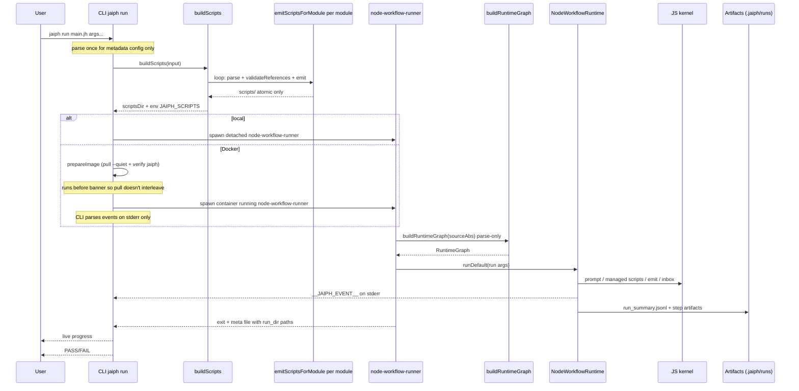
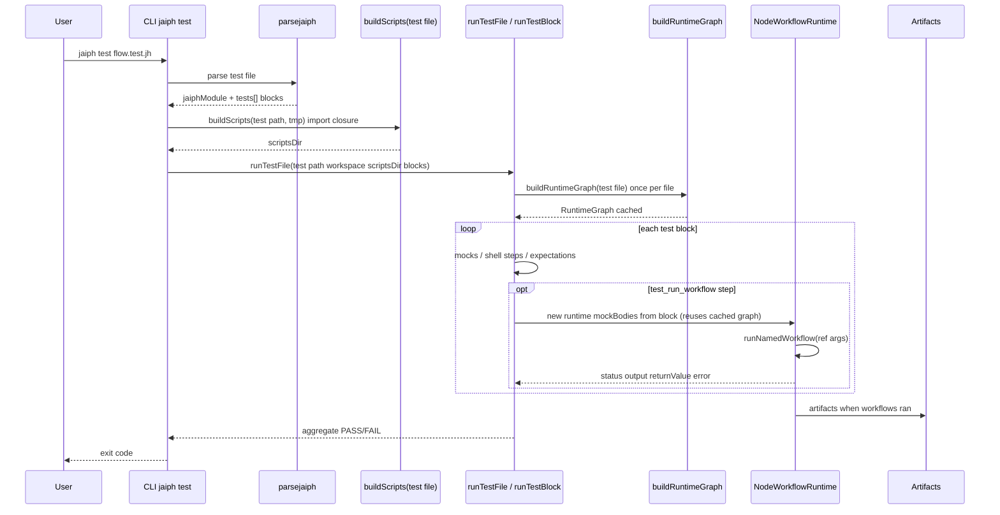

# Architecture

Jaiph is a workflow system with a **TypeScript CLI** and a **JavaScript kernel** (`src/runtime/kernel/`) that interprets the workflow AST in process — there is no separate “workflow shell” emitted for execution.

This page describes **how Jaiph is built**: repository layout of major subsystems, **core components**, compile and run pipelines, and **runtime contracts** (events, artifacts on disk, distribution). It is the map of the implementation. For workflow syntax and semantics, see the [Language](language.md) guide; this document stays on implementation boundaries.

**Why this split:** the transpiler turns each `script` block (and inline script bodies) into real files under `scripts/` with a stable layout and `JAIPH_SCRIPTS`, while **`NodeWorkflowRuntime` always executes from the AST** (`buildRuntimeGraph`). That separation keeps bash entrypoints predictable for subprocesses without duplicating workflow logic in a second language.

For **how to contribute** — branches, test layers, E2E assertion policy, and bash harness details — see [Contributing](contributing.md). For the `*.test.jh` **language** and test blocks, see [Testing](testing.md).

## System overview

Workflow authors write `.jh` / `.test.jh` modules. The toolchain turns those files into **validated** modules plus **extracted script files**, then the **same AST interpreter** runs workflows whether you use local `jaiph run`, Docker, or `jaiph test`.

1. Parse source into AST (the CLI parses once up front for `jaiph run` metadata such as `runtime` config; `buildRuntimeGraph` and transpilation use the same parser on disk contents).
2. **Compile-time** validation (`validateReferences`, invoked from **`emitScriptsForModule`** / **`buildScripts()`**) runs before script extraction, not inside `buildRuntimeGraph()` (the graph loader only parses modules and follows imports). The **`jaiph compile`** command walks the same import closure but runs **`validateReferences` only**: it parses each reachable module on disk and **does not** emit **`scripts/`** (no **`buildScriptFiles`** / **`buildScripts`**), **does not** invoke **`buildRuntimeGraph()`**, and never spawns the workflow runner (`src/cli/commands/compile.ts`). For a **directory** argument it discovers `*.jh` via `walkjhFiles`, which **skips** `*.test.jh`; to validate a test module, pass that file explicitly. Imported modules in the closure are still validated recursively either way.
3. **CLI** (`dist/src/cli.js` via npm, or a **Bun-compiled** `dist/jaiph` binary) prepares script executables (scripts-only), then spawns a **detached child** that loads **`node-workflow-runner.js`**. That child calls `buildRuntimeGraph()` and runs **`NodeWorkflowRuntime`**. The child’s interpreter is **`process.execPath`** of the CLI process (Node when you run `node dist/src/cli.js`, the standalone Bun binary when you run `dist/jaiph`). Script steps execute as managed subprocesses; prompt, inbox I/O, and event/summary emission are handled by the kernel under `src/runtime/kernel/`.
4. Stream live events to the CLI and persist durable run artifacts.

Interactive **`jaiph run`** parses **`__JAIPH_EVENT__`** lines from the runner’s stderr, renders the progress tree, and runs hooks. **`jaiph run --raw`** skips that shell: the child uses inherited stdio so events still land on stderr unchanged — used when embedding Jaiph or when the host wraps a container (see [CLI — `jaiph run`](cli.md#jaiph-run) and [Sandboxing — Docker container isolation](sandboxing.md#docker-container-isolation)).

All orchestration — local `jaiph run`, `jaiph test`, and **Docker `jaiph run`** — uses the **Node workflow runtime** (AST interpreter). Docker containers run the same `node-workflow-runner` process with the compiled JS source tree and scripts mounted read-only.

## Core components

- **CLI (`src/cli`, invoked via compiled `src/cli.ts` → `dist/src/cli.js`)**
  - Entry point (`run`, `test`, `compile`, `init`, `install`, `use`, `format`). Paths ending in `.jh` / `.test.jh` are also accepted as implicit commands (see `src/cli/index.ts`).
  - **Workflow launch** is owned in TypeScript (`src/runtime/kernel/workflow-launch.ts` + `src/cli/run/lifecycle.ts`): spawns **`node-workflow-runner.js`** with `process.execPath`, which calls `buildRuntimeGraph()` then `NodeWorkflowRuntime`. The **`jaiph run`** path always launches the **`default`** workflow via argv wired in `workflow-launch.ts` (`node-workflow-runner` calls `runDefault`). `setupRunSignalHandlers` accepts an optional `onSignalCleanup` callback for Docker sandbox teardown on SIGINT/SIGTERM.
  - Parses runtime events and renders progress (except `--raw`); dispatches hooks.

- **Parser (`src/parser.ts`, `src/parse/*`)**
  - Converts `.jh`/`.test.jh` into `jaiphModule` AST.
  - Reusable primitives: `parseFencedBlock()` (`src/parse/fence.ts`) handles triple-backtick fenced bodies with optional lang tokens for scripts and inline scripts. `parseTripleQuoteBlock()` (`src/parse/triple-quote.ts`) handles `"""..."""` blocks for prompts, `const`, `log`, `logerr`, `fail`, `return`, and `send` — all positions where multiline strings appear.

- **AST / Types (`src/types.ts`)**
  - Shared compile-time schema (`jaiphModule`, step defs, test defs, hook payload types).

- **Validator (`src/transpile/validate.ts`)**
  - Resolves imports and symbol references; emits deterministic compile-time errors. Import resolution (`resolveImportPath` in `transpile/resolve.ts`) checks relative paths first, then falls back to project-scoped libraries under `<workspace>/.jaiph/libs/` — the workspace root is threaded through all compilation call sites. Export visibility is enforced by `validateRef` in `validate-ref-resolution.ts`: if an imported module declares any `export`, only exported names are reachable through the import alias.

- **Transpiler (`src/transpiler.ts`, `src/transpile/*`)**
  - **`emitScriptsForModule`** parses, runs **`validateReferences`**, and **`buildScriptFiles`** — the only compile path for `jaiph run` / `jaiph test` — **persists only atomic `script` files** under `scripts/`. **`buildScripts()`** can also take a **directory** of non-test `*.jh` modules (`src/transpile/build.ts` uses `walkjhFiles`); the **`jaiph run`** and **`jaiph test`** commands always pass a **single entry file** (`.jh` or `*.test.jh`). Inline scripts (`` run `body`(args) ``) are also emitted as `scripts/__inline_<hash>` with deterministic hash-based names (`inlineScriptName` in `src/inline-script-name.ts`). There is no workflow-level bash emission.

- **Node Workflow Runtime (`src/runtime/kernel/node-workflow-runtime.ts`)**
  - `NodeWorkflowRuntime` interprets the AST directly: walks workflow steps, manages scope/variables, delegates prompt and script execution to kernel helpers, handles channels/inbox/dispatch, owns the frame stack and heartbeat, and writes run artifacts.
  - Three sibling modules under `src/runtime/kernel/` carry concerns that used to live inline in the runtime file. Dependency direction is one-way (orchestrator → helpers/emitter/mock); no circular imports back.
    - **`runtime-arg-parser.ts`** — stateless interpolation and call-argument parsing (`interpolate`, `parseInlineCaptureCall`, `commaArgsToInterpolated`, `parseArgsRaw`, `parseInlineScriptAt`, `parseManagedArgAt`, `parseArgTokens`, `stripOuterQuotes`, `parsePromptSchema`, `sanitizeName`, `nowIso`) plus shared constants and the `ParsedArgToken` / `PromptSchemaField` types. Direct unit tests live in `runtime-arg-parser.test.ts`.
    - **`runtime-event-emitter.ts`** — `RuntimeEventEmitter` owns **`__JAIPH_EVENT__`** writes on stderr (step/log traffic when not suppressed), **`run_summary.jsonl`** appends for the wider timeline (including workflow/prompt records that are summary-first), plus step/prompt sequence counters. Constructed with `{ runId, runDir, env, getFrameStack, getAsyncIndices, suppressLiveEvents? }`; the runtime delegates structured emission to it. The optional `suppressLiveEvents` flag (forwarded from `NodeWorkflowRuntime`'s `suppressLiveEvents` option) skips the live stderr **`__JAIPH_EVENT__`** lines while **`appendRunSummaryLine`** keeps updating **`run_summary.jsonl`** — used by in-process callers like the test runner that share stderr with `node --test` reporter output. The CLI's spawned `node-workflow-runner` child does not set it, so production runs stream events to stderr as before.
    - **`runtime-mock.ts`** — `executeMockBodyDef` and `executeMockShellBody` for `*.test.jh` workflow/rule/script mocks. Shell-kind mocks run `bash -c`; steps-kind mocks dispatch back into the runtime via an `executeStepsBack` callback so the body runs against the full step interpreter.
  - `buildRuntimeGraph()` (`graph.ts`) loads reachable modules with **`parsejaiph` only** (import closure); it does **not** run `validateReferences`. Cross-module refs are resolved from that graph at runtime. For **`script import`** declarations, `buildRuntimeGraph()` injects synthetic `ScriptDef` stubs (`graph.ts`) so reference resolution matches the validated compile path without re-reading external script bodies at graph-build time.

- **Node Test Runner (`src/runtime/kernel/node-test-runner.ts`)**
  - Executes `*.test.jh` test blocks using `NodeWorkflowRuntime` with mock support (mock prompts, mock workflow/rule/script bodies). Pure Node harness — no Bash test transpilation.

- **JS kernel (`src/runtime/kernel/`)**
  - Prompt execution (`prompt.ts`), streaming parse (`stream-parser.ts`), schema (`schema.ts`), **`mock.ts`** (sequential prompt responses / mock-arm dispatch from test env JSON), **`runtime-mock.ts`** (mock workflow/rule/script **bodies** for `*.test.jh`), **`emit.ts`** (durable **`run_summary.jsonl`** helpers — `appendRunSummaryLine`, `formatUtcTimestamp` — consumed by `RuntimeEventEmitter`), **`workflow-launch.ts`** (spawn contract). **`RuntimeEventEmitter`** (`runtime-event-emitter.ts`) owns live **`__JAIPH_EVENT__`** lines on stderr and coordinates summary writes plus step/prompt sequence counters. Script subprocesses are launched directly from `NodeWorkflowRuntime`.

- **Formatter (`src/format/emit.ts`)**
  - `jaiph format` rewrites `.jh` / `.test.jh` files into canonical style. Pure AST→text emitter; no side-effects beyond file writes.

- **Docker runtime helper (`src/runtime/docker.ts`)**
  - Parses mount specs, resolves Docker config (image, network, timeout), and builds the `docker run` invocation when the CLI enables **Docker sandboxing** for `jaiph run` (environment-driven; there is no `jaiph run --docker` flag — see [Sandboxing](sandboxing.md)). The container runs the same `node-workflow-runner` entry as local execution. The default image is the official `ghcr.io/jaiphlang/jaiph-runtime` GHCR image; every selected image must already contain `jaiph` (no auto-install or derived-image build at runtime). Image preparation (`prepareImage`) runs before the CLI banner: it checks whether the image is local, pulls with `--quiet` if needed (short status lines on stderr instead of Docker’s default pull UI), and verifies that `jaiph` exists in the image. `spawnDockerProcess` does not pull or verify — it receives a pre-resolved image. The spawn call uses `stdio: ["ignore", "pipe", "pipe"]` — stdin is ignored so the Docker CLI does not block on stdin EOF, which would stall event streaming and hang the host CLI after the container exits.
  - **Workspace immutability:** Docker runs cannot modify the host workspace. The host checkout is mounted read-only; `/jaiph/workspace` is a sandbox-local copy-on-write overlay discarded on exit. The only host-writable path is `/jaiph/run` (run artifacts). Workflows that need to capture workspace changes should write files (for example a `git diff` into a temp path) and publish them with `artifacts.save()`. See [Sandboxing](sandboxing.md) for the full contract and [Libraries — `jaiphlang/artifacts`](libraries.md#jaiphlangartifacts--publishing-files-out-of-the-sandbox).

## Runtime vs CLI responsibilities

### Runtime responsibilities (Node workflow runtime)

- Interpret the AST and execute workflow semantics directly (`NodeWorkflowRuntime`).
- Manage channels (`send`, routes, queue drain) through kernel logic.
- Emit step/log events; persist run logs and summary timeline.
- Prompt steps and managed script subprocesses: Node kernel owns execution, events, and control flow.
- Execute test blocks with mock support (`runTestFile()` in `node-test-runner.ts`).

### CLI responsibilities

- Parse, validate, and launch workflows/tests.
- Own **process spawn** for `jaiph run` (detached workflow runner process group for signal propagation).
- Parse live runtime events; render terminal progress; trigger hooks — skipped in **`jaiph run --raw`** (child stdio inherited; see [CLI](cli.md#jaiph-run)).

## Contracts

- **Live contract (runtime → observing process):** `__JAIPH_EVENT__` JSON lines on **stderr only** — the structured event channel. Hooks and the interactive CLI consume that stream; see [Hooks](hooks.md).
- **Durable contract:** `.jaiph/runs/...` + `run_summary.jsonl` (layout below).

Channel transport remains file/queue based in runtime inbox logic.

### Durable artifact layout

For an onboarding-style description of the same paths (what to expect in a repo, what to ignore in git), see [Runtime artifacts](artifacts.md).

The runtime persists step captures and the event timeline under a UTC-dated hierarchy:

```
.jaiph/runs/
  <YYYY-MM-DD>/                       # UTC date (see NodeWorkflowRuntime)
    <HH-MM-SS>-<source-basename>/       # UTC time + JAIPH_SOURCE_FILE or entry basename
      000001-module__step.out          # stdout capture per step (6-digit seq prefix)
      000001-module__step.err          # stderr capture (may be empty)
      artifacts/                       # user-published files (JAIPH_ARTIFACTS_DIR); created at run start
      inbox/                           # audit copies of routed channel payloads (optional)
      heartbeat                        # liveness: epoch ms, refreshed about every 10s
      return_value.txt                 # when `jaiph run` default workflow returns a value (success only)
      run_summary.jsonl                # durable event timeline
```

Step sequence numbers are monotonic and unique per run: `RuntimeEventEmitter` allocates them in memory (`allocStepSeq`) when opening each step’s capture files (`%06d-<safe_name>.out|.err`). There is no `.seq` file in the run directory.

## Channels and hooks in context

Channels are validated at compile time (`validateReferences` / send RHS rules) and executed via in-memory queue and dispatch in the Node runtime; durable **`inbox/`** files under the run directory appear only for **routed** sends (audit — see [Inbox & Dispatch](inbox.md)). Hooks are CLI-only: they load from `hooks.json` and run as shell commands with JSON on stdin, driven by the same `__JAIPH_EVENT__` stream as the progress UI — see [Hooks](hooks.md).

## Test runner integration (`*.test.jh` in the kernel)

**How** `jaiph test` wires into the same stack as `jaiph run`: `*.test.jh` files are parsed in the CLI; `runTestFile()` drives blocks in-process. **`buildRuntimeGraph(testFile)`** is called **once per `runTestFile` invocation** and the resulting graph is reused across all blocks and `test_run_workflow` steps (the import closure is constant for a given test file within a single process run). Each `test_run_workflow` step resolves mocks against that cached graph, then constructs `NodeWorkflowRuntime` with `mockBodies` / mock prompt env, passing **`suppressLiveEvents: true`** so **`RuntimeEventEmitter`** skips writing **`__JAIPH_EVENT__`** lines to **stderr** while still appending **`run_summary.jsonl`** for that run. Without this flag, every workflow event would print to the test process's stderr and swamp `node --test` reporter output. Mock prompts, workflows, rules, and scripts are supported through the runtime's mock infrastructure.

Before that, the CLI prepares script executables via **`buildScripts(testFileAbs, tmpDir, workspaceRoot)`** — the same **`buildScripts`** helper as `jaiph run`, with the **test file as the entrypoint**. That walks the test module and its **import closure** (transitive `import` edges), runs **`validateReferences`** / **`emitScriptsForModule`** per reachable file, and writes `scripts/` so imported workflows have paths under `JAIPH_SCRIPTS`. Unrelated `*.jh` files elsewhere in the repo are not compiled unless imported.

Authoring rules, fixtures, and mock syntax for `*.test.jh` are documented in [Testing](testing.md), not here.

## CLI progress reporting pipeline

The progress UI combines a **static** step tree derived from the workflow AST (`src/cli/run/progress.ts`) with **live** updates from the runtime event stream. Event wiring: `src/cli/run/events.ts` and `src/cli/run/stderr-handler.ts` parse `__JAIPH_EVENT__` lines; `src/cli/run/emitter.ts` bridges into the renderer. Line-oriented formatting (`formatStartLine`, `formatHeartbeatLine`, `formatCompletedLine`) lives primarily in `src/cli/run/display.ts`, which shares some display helpers with `progress.ts`. Async branch numbering (subscript ₁₂₃… prefixes) is driven by `async_indices` on step and log events — the runtime propagates a chain of 1-based branch indices through `AsyncLocalStorage`, and the stderr handler renders them at the appropriate indent level. `const` steps whose value is a `match_expr` are walked for nested `run`/`ensure` arms; matched targets appear as child items in the step tree (e.g. `▸ script safe_name` under the `const` row). This pipeline does not apply to **`jaiph run --raw`**.

## Distribution: Node vs Bun standalone

- **Development / npm:** `npm run build` runs `tsc`, copies **`src/runtime/`** to **`dist/src/runtime/`** (kernel, `docker.ts`, etc.), then copies **`runtime/overlay-run.sh`** from the repo root into **`dist/src/runtime/overlay-run.sh`**. The published `jaiph` bin is **`node dist/src/cli.js`**.
- **Standalone:** `npm run build:standalone` runs the same build, copies **`dist/src/runtime`** to **`dist/runtime`** beside the binary, then `bun build --compile ./src/cli.ts --outfile dist/jaiph`. Workflow launch still spawns `node-workflow-runner.js` using **`process.execPath`**, so the standalone artifact is **self-contained** (no separate Node install) when end users run that binary. **Bash** (or whatever shebang your `script` steps use) is still required on the host for script subprocesses. Ship **`dist/jaiph`** with **`dist/runtime`** alongside it so kernel paths resolve (same layout as `npm run build:standalone`; table in [Contributing](contributing.md)).

## Mermaid architecture diagram

```mermaid
flowchart TD
    U[User / CI] --> CLI[CLI: Node or Bun jaiph]

    subgraph Transpile["Per-module: emitScriptsForModule()"]
        PARSE[parsejaiph]
        VAL[validateReferences]
        EMIT[Emit atomic script files under scripts/]
        PARSE --> VAL
        VAL -->|compile errors| ERR[Deterministic compile errors]
        VAL --> EMIT
    end

    CLI -->|jaiph run| BS1[buildScripts]
    BS1 --> Transpile

    CLI -->|jaiph test| BS2[buildScripts(entry .test.jh)]
    BS2 --> Transpile
    BS2 --> TR[Node Test Runner in-process]

    Transpile -->|jaiph run local| RW[Node workflow runner child]
    Transpile -->|jaiph run Docker| DC[Container runs node-workflow-runner]

    RW --> G[buildRuntimeGraph parse-only + imports]
    G --> GRAPH[RuntimeGraph]
    RW --> RT[NodeWorkflowRuntime]
    RT --> GRAPH

    DC --> G
    DC --> RT

    TR -->|test_run_workflow| G
    TR --> RT

    RT -->|script steps| SCRIPT[Managed script subprocesses]
    RT -->|prompt steps| KERNEL[Kernel libs: prompt, events, inbox, stream, schema, mock]

    RT -->|live events| EV["__JAIPH_EVENT__ stderr only"]
    EV --> CLI
    CLI --> PR[Progress rendering]

    RT -->|channels files / queues| INBOX[Inbox under .jaiph/runs]
    RT -->|durable artifacts| SUM[.jaiph/runs + run_summary.jsonl]
    CLI --> HK[Hook dispatcher via event stream]
    HK --> HPROC[Hook shell commands]
```

**Emit artifacts:** `buildScripts()` persists **only** extracted **`script`** bodies under `scripts/`. No workflow-level shell modules or `jaiph_stdlib.sh` are produced.

## Sequence diagram: regular flow (`*.jh`)

Interactive **`jaiph run`** (no **`--raw`**): banner, progress tree, hooks, and PASS/FAIL footer.



**Docker:** the inner container command is **`jaiph run --raw …`** (see [Sandboxing](sandboxing.md#docker-container-isolation)): no banner or progress UI inside the container; **`__JAIPH_EVENT__`** lines still appear on stderr for the host CLI to parse.

## Sequence diagram: `jaiph test` flow



## Summary

- `.jh` / `*.test.jh` share parser/AST; **compile-time** validation runs in **`emitScriptsForModule`** during **`buildScripts`**. **`buildRuntimeGraph`** loads modules with **parse-only** imports.
- **`jaiph compile`** walks import closures with **`validateReferences` only**, and exits — no **`scripts/`** emission (**no **`buildScriptFiles`** / **`buildScripts`**), no **`buildRuntimeGraph()`**, no runner spawn. Directory discovery omits **`*.test.jh`** unless you pass a test file explicitly.
- **Node-only runtime:** all execution — local `jaiph run`, Docker `jaiph run`, and `jaiph test` — goes through `NodeWorkflowRuntime`. Docker containers run `node-workflow-runner` with the compiled JS tree and scripts mounted, using the same semantics as local execution.
- **CLI** owns launch, observation, hooks (except **`jaiph run --raw`**), and runtime preparation (`buildScripts`). **`jaiph run --raw`** still emits **`__JAIPH_EVENT__`** on stderr from the runtime; the CLI does not attach the interactive progress/hooks pipeline. **`jaiph test`** passes **`suppressLiveEvents: true`** into **`NodeWorkflowRuntime`** so **`RuntimeEventEmitter`** skips writing those live stderr lines while **`run_summary.jsonl`** still records workflow traffic where the emitter appends it.
- Workflow execution runs in **`NodeWorkflowRuntime`**, with **script steps** as managed subprocesses.
- No workflow-level `.sh` files or `jaiph_stdlib.sh` are produced or required.
- Contracts: `__JAIPH_EVENT__`, `.jaiph/runs`, `run_summary.jsonl`, hook payloads.
